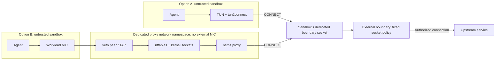
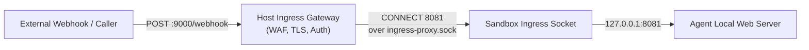

# AGENTS.NET: Sandbox Networking Specification

**Status:** Draft

`agents.net` defines a network interface between a sandbox and an external
policy-enforcing proxy. Applications use ordinary sockets. An adapter, either
inside the sandbox or in a dedicated network namespace, converts supported
connections into HTTP `CONNECT` requests. Both adapters deliver requests through
a dedicated boundary socket. The boundary applies that socket's assigned policy
before opening an upstream connection. The sandbox has no direct external
network path.

Applications cannot bypass this policy by ignoring proxy settings or replacing
the adapter, provided runtime confinement remains intact. Runtime adapters and
proxies use the same HTTP interface;
no particular proxy, service mesh, or orchestration system is required. An
optional application gateway can attach service credentials without giving the
reusable key to the workload.

TCP connections can target hostnames, IPv4 addresses, or IPv6 addresses. The
boundary applies policy to each destination. UDP tunneling and ingress are
optional. Sections 1 through 4 define the interface
and security requirements. Sections 5 through 8 describe implementation patterns,
examples, and test coverage; they are informative.

---

## 1. Architecture

### 1.1 Components

This specification uses the following terms:

- **Sandbox:** An isolated, untrusted workload with no direct external network access. Its only networking is through one of the adapter paths below.
- **Adapter:** The component that translates application traffic into CONNECT requests. It runs inside the sandbox with a TUN interface, or outside it in a dedicated network namespace terminating its veth or TAP. It has no authority to grant access.
- **Boundary socket:** A dedicated, access-controlled endpoint assigned to one sandbox lifetime and policy. In the local model it is a pathname Unix stream socket.
- **Boundary proxy:** The external proxy that authorizes requests and opens upstream connections.
- **Controller:** The trusted runtime or launcher that creates the sandbox, adapter environment, socket access, and policy binding. This is a responsibility, not a requirement for a separate control-plane service.

Applications MUST NOT be required to cooperate with network confinement:

- Clients that ignore `HTTP_PROXY`, including clients configured with `trust_env=False`, remain subject to policy.
- Clearing or replacing environment variables does not grant network access.
- Supported TCP connections use the same tunnel mechanism for HTTP, database protocols, SSH, and other byte-stream protocols.

### 1.2 Network Path

For each supported connection, the adapter sends the destination hostname or
IP address and port to the boundary proxy. The proxy authorizes the request,
resolves hostnames when needed, and connects to an allowed address. Denied
requests fail at the tunnel handshake.
There are two adapter paths. They implement the same boundary interface and
have the same destination-policy requirements.



The diagram shows alternatives for one sandbox, not a shared endpoint for
unrelated sandboxes. In option A, the sandbox has no external NIC. In option B,
its only NIC terminates in the proxy namespace, with no bridge or route to an
external network. Changing guest routes does not create another exit.

For a VM using option A, a Unix socket is not directly accessible across the
guest kernel. The runtime must provide a restricted channel, such as a dedicated
VSOCK relay bound to that VM's boundary socket. An unrestricted host VSOCK
listener is not equivalent. VM channel provisioning is a deployment extension;
the local container and namespace model does not require it.

### 1.3 Local Security Model

The baseline is one dedicated boundary socket per sandbox lifetime:

```text
sandbox A -> adapter A -> socket A -> policy A -> permitted destinations
sandbox B -> adapter B -> socket B -> policy B -> permitted destinations
```

The controller creates the socket-to-policy binding. The boundary selects
identity from the listener that accepted the connection, never from CONNECT
headers, source IPs, or the adapter's claims. All connections and HTTP/2 streams
accepted on that listener use the same sandbox identity. A single socket
pathname supports many connections; it does not require FD passing.

The simplest deployment runs one boundary process per sandbox, with one
listener and one fixed policy. A boundary implementation may instead share a
process across dedicated listeners if it keeps their policies and resources
separate. A shared process remains a shared compromise boundary. A single
listener serving multiple workload identities is not part of the baseline.

The local model requires:

1. **Confinement:** Neither the sandbox nor its adapter has an external network path other than the assigned socket. The namespace proxy must also be restricted from accessing other boundary sockets, host management sockets, or inherited external sockets; a network namespace alone does not restrict filesystem access.
2. **Socket access:** The controller owns the socket directory and policy. Mount visibility, filesystem permissions, and runtime isolation prevent other untrusted workloads from connecting or replacing the endpoint. A pathname or numeric mode alone is not evidence that these restrictions hold.
3. **Fixed identity:** Access to the socket grants use of its sandbox policy, not unrestricted upstream access. No guest-held certificate, identity header, or per-request credential exchange is needed to select that policy.
4. **External enforcement:** The boundary treats all CONNECT fields as untrusted, parses them, checks destination/port/transport policy, and dials only an authorized address. The adapter is not an authorization component.
5. **Opaque content:** A successful CONNECT permits an untrusted byte stream or datagrams to one selected destination. It does not authenticate application intent or make content safe.
6. **Bounded lifetime:** The controller installs policy before exposing the endpoint and revokes the endpoint and its active flows during teardown. Socket access is never reassigned to a different sandbox while old sessions remain live.

The host kernel, runtime confinement, controller, and boundary are trusted.
Compromise of either adapter must not grant more than use of its assigned
socket policy; protecting the host from such a compromise is the runtime's
responsibility. The namespace adapter exposes the host kernel's packet stack,
whereas the in-guest TUN adapter performs translation inside the sandbox. The
two adapters also differ in privilege: the TUN adapter needs `CAP_NET_ADMIN`
and `/dev/net/tun` inside the sandbox to create its device, while the
namespace adapter needs `CAP_NET_ADMIN` only in its own namespace and the
workload needs no capability. The reference launcher drops `CAP_NET_ADMIN`
from itself and from the workload's bounding set once the device exists.

FD registration, `SCM_CREDENTIALS`, workload mTLS, attestation, credential
injection, and ingress are optional extensions, not prerequisites for this
local model. The applicable security requirements below still apply when an
extension is selected.

### 1.4 Socket Ownership and Namespace Access

For egress, the boundary is the Unix socket server and the adapter is its
client. The boundary creates and listens on the socket in its own environment;
the adapter connects to it. The boundary does not connect to a listener in the
adapter, enter the adapter's network namespace, or receive its namespace FD.

```text
Boundary environment                         Adapter environment

listen: /run/agents.net/sandbox-A/boundary.sock
                      ^
                      | same socket, exposed by the runtime
                      |
                      +----- connect: /run/agents.net/boundary.sock

accept CONNECT -> authorize -> dial upstream
```

On Linux, pathname Unix sockets can connect across network namespaces on the
same kernel. The client must be able to resolve the socket inode through its
filesystem view and pass the applicable permissions and security checks. No IP
route, veth connection to the host, or `setns` call is needed for that Unix
connection. Abstract Unix socket names, unlike pathname sockets, are scoped by
the network namespace; the baseline uses pathname sockets.

The runtime exposes the socket as follows:

1. Start the boundary listener in a protected per-sandbox directory with its policy configured and access restricted before exposing it.
2. Bind-mount only that socket, or its dedicated directory, into the adapter's mount namespace. The host and adapter pathnames may differ; they refer to the same socket. Configure the adapter with the path visible inside its environment.
3. Grant the adapter's mapped UID/GID permission to connect while keeping the directory and endpoint under trusted ownership. A read-only bind mount can prevent filesystem changes through that mount, but does not make socket communication read-only or replace socket access checks.
4. Start the sandbox only after the adapter is ready. During teardown, close active sessions and remove exposure. If an individually mounted socket is unlinked and recreated, its mount still references the old inode; restart must establish the new exposure explicitly.

The TUN adapter gets this mount inside the sandbox. The namespace adapter gets
it in its own restricted process environment, outside the workload; the workload
does not need the socket mounted. Processes already sharing a filesystem view
can resolve the same path without a bind mount, but sharing the host filesystem
is not a substitute for restricting the adapter's access.

A central boundary can own several dedicated listeners in one network
namespace, each bound to a different sandbox policy. Its upstream sockets are
created in the boundary's network namespace. The adapters remain in their
respective namespaces. The reference command currently serves one listener per
process; multi-listener dispatch is a deployment option, not an implemented
feature of that command.

| Mechanism | Purpose | Needed for the local socket path? |
| --- | --- | --- |
| Pathname visibility, permissions, and runtime isolation | Expose exactly the assigned endpoint and control who can connect | Yes |
| `SO_PEERCRED` or `SO_PASSCRED` / `SCM_CREDENTIALS` | Obtain kernel-checked peer or sender credentials; does not expose or transfer a socket | No; optional additional access or audit checks |
| `SCM_RIGHTS` | Pass access to an already-open socket FD over Unix IPC | No; optional alternative provisioning mechanism |
| Entering a network namespace | Run packet redirection or create network sockets in that namespace | The namespace adapter runs there; the boundary does not |

These rules concern processes sharing the host kernel. A VM cannot use a host
Unix socket through a filesystem mount alone; it needs the runtime channel
described in Section 1.2. Optional ingress reverses client/server roles but is a
separate channel and does not change the egress arrangement.

---

## 2. Protocol Requirements

The key words "MUST", "MUST NOT", "REQUIRED", "SHALL", "SHALL NOT", "SHOULD", "SHOULD NOT", "RECOMMENDED", "NOT RECOMMENDED", "MAY", and "OPTIONAL" in this document are to be interpreted as described in BCP 14 (RFC 2119, RFC 8174).

### 2.1 Egress Boundary Interface (Enforced)

The Egress Boundary Interface defines how traffic leaves the sandbox:

1. **TCP:** Supported external TCP flows MUST use HTTP CONNECT (RFC 9110 Section 9.3.6) with the destination hostname or IP address and an explicit port. HTTP/1.1 is the baseline; HTTP/2 multiplexing is optional. Tunnels carry arbitrary TCP byte streams, not raw IP packets.
2. **Names and addresses:** Adapters MUST preserve a hostname when a mapping is available. Otherwise, they MUST forward the destination IP address without requiring a DNS lookup or inventing a hostname. Boundaries MUST support both forms and authorize them according to policy. IP literals MUST NOT be rejected solely because no hostname is available. IPv6 literals use brackets in the CONNECT authority.
3. **Optional UDP:** UDP tunneling MUST be explicitly enabled at the adapter and boundary. RFC 9298 uses an HTTP/1.1 `GET` upgrade or HTTP/2 extended CONNECT with `:protocol: connect-udp`, carrying RFC 9297 capsules on a reliable stream. Disabled or unsupported capabilities MUST NOT fall back to direct networking.
4. **Constrained channel:** The workload MUST reach the boundary through an access-controlled channel, such as a dedicated Unix socket or a restricted VSOCK service. The controller MUST exclude alternative external paths, other workloads' endpoints, and unauthorized host services. A TCP boundary listener is useful for component tests but alone is not sandbox confinement.
5. **External authorization:** Before dialing, the boundary MUST authorize the workload identity, destination, port, and transport under current policy. Hostnames require name policy and checks on each resolved address; literals require IP or CIDR policy. The boundary MUST deny unknown identities and unavailable policy, and dial only checked addresses, including retries, without an unchecked second DNS resolution. Internal services MAY be authorized explicitly; private, loopback, and metadata access must not arise implicitly from a name allowlist.
6. **Explicit refusal:** A denied CONNECT MUST return HTTP `403 Forbidden` with a bounded `Boundary-Reason`. The adapter MUST expose a connection failure without silently bypassing the boundary. TCP connect refusal, reset, and UDP error semantics differ; an HTTP status is not an application response inside the tunnel.
7. **Failure and limits:** Boundary unavailability MUST NOT create an alternate network path. Setup, failure detection, and idle resource retention MUST be bounded. Implementations MUST document deadlines, connection and buffer quotas, and whether policy revocation terminates established streams. Fail-closed is an isolation property, not a promise of instantaneous failure detection.

The adapter's supported resolver behavior is part of its compatibility profile.
The reference adapter's DNS behavior is described in Section 5.1.

Examples of valid HTTP/1.1 tunnel requests:

```http
CONNECT api.example.com:443 HTTP/1.1
Host: api.example.com:443

CONNECT 203.0.113.10:443 HTTP/1.1
Host: 203.0.113.10:443

CONNECT [2001:db8::10]:443 HTTP/1.1
Host: [2001:db8::10]:443
```

Each request is independently authorized. An IP destination still uses the
boundary channel; it does not give the workload a direct external network path.

### 2.2 Identity and Metadata

- **Guest metadata:** Headers such as `Sandbox-Id` MAY carry telemetry. They MUST NOT select an identity or grant permissions. The boundary MUST discard or overwrite guest identity headers before passing identity to another trusted service.
- **Dedicated endpoint:** In the local model, the controller MUST bind the listener to one sandbox lifetime and policy. Socket access controls establish permission to use that policy. Peer credentials MAY provide additional audit or access checks; they are not required to rediscover an identity already fixed by the listener.
- **Other transports:** A deployment using a shared listener or VM relay MUST provide an equivalent trusted binding. Unix peer credentials and VSOCK CIDs require a mapping that handles restarts and identifier reuse. The socket peer may be a runtime process rather than the application. These identifiers are not cryptographic attestation.
- **Optional mTLS:** The channel MAY use mTLS with a deployment-issued workload certificate. The certificate format and issuing authority are deployment choices. The authenticated identity selects policy. A shared session MUST NOT select different identities from untrusted per-stream headers.

The wire format follows HTTP CONNECT (RFC 9110 Section 9.3.6), HTTP/2 CONNECT
(RFC 9113 Section 8.5), and, when UDP is enabled, RFC 9297 and RFC 9298. Policy
configuration and certificate issuance are outside the wire protocol.
Implementation-specific filters, APIs, and route resources are not part of this
specification.

### 2.3 TLS Inspection & Verification Models

CONNECT carries an opaque byte stream. TLS inspection is optional.

#### A. Passive TLS Handshake Peeking (No Decryption / Zero-CA)

CONNECT normally preserves end-to-end encryption. A tunnel-aware implementation
may inspect a visible TLS ClientHello and compare SNI with the requested
destination. This is an additional consistency check, not destination
authentication, payload inspection, or proof against domain fronting. Encrypted
ClientHello and non-TLS protocols limit visibility. An ordinary listener TLS
inspector does not automatically inspect TLS nested inside CONNECT streams.

#### B. Full TLS Termination / Forward Proxy MITM (Layer 7 Inspection)

When an operator requires Layer 7 visibility (e.g. for credential injection, compliance auditing, Data Loss Prevention, or structured agent instructions):

1. **Root CA Mounting:** The host mounts a trusted Root CA certificate into the sandbox:

   ```bash
   AGENT_CA_CERT=/var/run/agent-ca.pem
   ```

2. **Trust Store Coordination:** The sandbox environment SHOULD map `AGENT_CA_CERT` to standard runtime environment variables:
   - `REQUESTS_CA_BUNDLE=$AGENT_CA_CERT`
   - `SSL_CERT_FILE=$AGENT_CA_CERT`
   - `NODE_EXTRA_CA_CERTS=$AGENT_CA_CERT`
3. **Request processing:** The application gateway can attach host-held credentials to authorized requests, inspect or redact content, and return application-level errors or rate limits.
4. **Trust configuration:** Applications that do not trust the gateway's CA fail certificate validation for inspected destinations. Uninspected tunnels and destination policy are unaffected.

The gateway needs protocol-specific support for HTTP versions, streaming, and
credential use. Certificate pinning may prevent TLS inspection. Keeping a key
outside the sandbox does not prevent abuse of the API: permitted operations and
usage also need limits. These functions are separate from CONNECT tunneling.

### 2.4 Ingress Interface (Inbound Traffic)

To allow an isolated sandbox to receive webhooks, OAuth callbacks, or prompts
without a per-sandbox external address or published port:



1. **Host Ingress Gateway:** A production gateway MUST authenticate requests, terminate public TLS, apply rate and payload limits, and authorize the external route to a specific workload and local service.
2. **Reverse Stream Channel:** An ingress stream channel (`ingress-proxy.sock` or vsock port) is provided inside the sandbox. When an external request arrives, the host connects to this channel using a stream handshake (`CONNECT <port>\n` -> `OK\n` or standard HTTP CONNECT).
3. **Loopback Forwarding:** The in-guest listener forwards the incoming stream to the agent's local web server listening on loopback (`127.0.0.1:$AGENT_INGRESS_PORT`).
4. **Coordination Variables:** The agent specifies its listening port and public callback URL via environment variables:

   ```bash
   AGENT_INGRESS_PORT=8081
   AGENT_PUBLIC_URL=https://agents.example.com/callbacks/agent-123
   ```

The trusted controller, not those guest variables alone, MUST authorize this
binding and revoke it during teardown. The textual `CONNECT <port>` handshake
is a deployment convention, not HTTP CONNECT. A portable ingress wire format
is not defined by this draft.

### 2.5 Lifecycle and Control Plane

The controller MUST establish confinement, endpoint access, identity, and policy
before enabling external flows. The baseline uses a dedicated endpoint with a
fixed policy. A process serving several dedicated listeners MUST preserve their
bindings; only a listener shared across identities needs additional identity
dispatch. No model can rely on tenant-supplied headers. Socket directories
MUST prevent one workload from replacing another workload's endpoints or
modifying boundary credentials, configuration, or audit files.

Policy updates MUST be versioned and auditable. Every decision SHOULD record
the controller-bound identity, requested destination, chosen upstream address,
port, transport, policy version, and result without logging secrets. Teardown
MUST revoke new access, dispose of flow resources according to the documented
revocation policy, and prevent stale routes or recycled identifiers from
granting access to a later workload.

---

## 3. Rationale

The design answers one question: how does an untrusted workload reach selected
services when neither the workload, its resolver, nor its network stack can be
trusted to enforce the selection? The answer is to give the sandbox no network
path and to replace it with a request naming a destination, which a trusted
component grants or denies before any external connection exists.

### 3.1 Comparison with Common Alternatives

| Property | CONNECT boundary (this specification) | Routed NIC with default-deny L3/L4 policy | Proxy settings (`HTTP_PROXY`, SDK options) |
| --- | --- | --- | --- |
| Enforcement independent of workload cooperation | Yes. The only path is the boundary channel; ignoring settings or replacing the adapter changes nothing. | Yes, for packets. | No. A client that ignores the settings connects directly. |
| Policy expressed as the destination the application named | Yes. The name is carried in the request; the boundary resolves it and dials the checked address. | No. Names must be pre-resolved into address sets. Shared hosting, CDNs, and anycast make address lists stale or broad; DNS-snooping rules race with TTLs and guest-side resolvers. | Yes, for cooperating clients. |
| Resolution performed by a trusted component | Yes. The guest receives synthetic addresses and never resolves the real one; guest-side rebinding cannot change the address dialed. | No. The guest resolves; the filter sees only the address. | Yes, for cooperating clients. |
| Guest packets processed by the host IP stack | TUN mode: no; the host sees an HTTP stream on a Unix socket. Namespace mode: only a dedicated namespace stack with no external interface. | Yes. Bridging, routing, connection tracking, and filtering process every guest packet. | Yes. |
| Denial visible to the application | Connection failure, with the requested name, port, and reason in the audit record. | Timeout or reset, with an address and port in the record. | Proxy error, for cooperating clients. |
| Per-flow attribution | Listener identity, name or address, port, transport, and decision. | Address, port, and network identity. | Name and port, for cooperating clients. |
| Reusable service credentials kept out of the workload | Yes, through an optional gateway on the same channel. | Requires a separate proxy path. | Same mechanism, but bypassable. |
| Enforcement point | Any CONNECT-capable proxy. | Per-host firewall rules and their lifecycle. | Any HTTP proxy. |
| Protocol coverage | TCP; UDP optional; no raw IP, ICMP, or multicast. | Everything the kernel routes. | What the client library supports. |
| Additional cost | Userspace translation (TUN) or redirection (namespace), a proxy hop, per-flow proxy state, synthetic DNS limits. | Per-workload address policy and its lifecycle. | None, and no guarantee. |

### 3.2 What Is and Is Not Gained

The design changes what the guest can request, not what an allowed service
will do. A successful tunnel carries arbitrary bytes to one authorized
destination. The boundary does not see inside end-to-end TLS, and an allowed
service may relay, store, or return hostile data. Destination policy is
necessary but not sufficient; application policy requires the separate gateway
described in Section 2.3.

The design removes the guest's IP-level reach. Port scans, raw sockets, ICMP or
DNS tunneling, and traffic to addresses that were never named end at the
adapter. The guest-facing attack surface is the boundary's CONNECT parser on an
access-controlled channel rather than the host's routing, bridging, connection
tracking, and filtering paths. Section 4 states the requirements that keep that
parser bounded.

| Benefit | Description |
| --- | --- |
| External enforcement | Applications cannot bypass destination policy by ignoring proxy settings or replacing the guest adapter while runtime isolation remains intact. |
| Destination preservation | The boundary receives the hostname when known, or the destination IP address, together with the port. |
| Host-held credentials | An optional application gateway attaches service credentials without giving the reusable key to the workload. |
| Standard protocol | Runtime adapters and proxies communicate through HTTP CONNECT rather than a runtime-specific protocol. |
| Separate configuration | Policy, service mappings, credentials, and audit records are managed outside workload images. |

For example, a coding workload can download allowed dependencies and call a
model API through ordinary clients. The boundary rejects other destinations.
An application gateway supplies the model credential. Operators configure the
boundary and gateway without changing the tool's networking code.

---

## 4. Security Considerations

### 4.1 Threat Model

The workload and either adapter may be malicious. They may forge CONNECT
requests, change DNS settings, open literal-IP connections, replace the adapter,
send malformed packets or HTTP frames, replay requests, and attempt resource
exhaustion. Guest-provided names, headers, packets, and payloads are untrusted.
Upstream services and their responses may also be malicious.

The trusted system consists of the host kernel, the isolation runtime or VMM,
the controller, and the boundary. An optional credential gateway or issuer adds
to that trusted system.
A container shares the host kernel; container root and VM guest-kernel
compromise are different threat models. Host-kernel or VMM compromise is outside
this interface's guarantees. Namespace mode adds the namespace-local kernel
network stack and trusted redirection setup to the packet path.

The guarantee is that external traffic crosses an authorized channel and
reaches only destinations permitted for its assigned workload. It is not a
guarantee about application intent, content safety, or the behavior of an
allowed service. Implementation status and verification gaps are listed in
Sections 7 and 8; requirements here are not claims that all controls exist.

### 4.2 What Can Be Established

CONNECT is a request for authority, not evidence that the caller already has
it. A request generated by the reference adapter has no special trust over an
identical request written by the workload itself.

| Input or observation | Required verification | Result and limit |
| --- | --- | --- |
| Channel ownership | Controller-configured listener binding and exclusive workload access; authenticated transport for deployments that require it | Identifies the sandbox policy available through the channel, not the particular code sending bytes |
| CONNECT destination | Strict parsing followed by destination, port, transport, and workload policy | Establishes permission to connect, not that the declared name describes the tunneled application |
| Resolved address | Boundary-side resolution and policy check on the exact address dialed | Establishes an allowed network destination; DNS alone does not authenticate the upstream service |
| Protected transport record | TLS verification or kernel-protected local IPC under the host trust assumptions | Detects unauthorized modification in transit; authenticated endpoints can still send malicious data |
| Tunneled content | No semantic verification in opaque tunnel mode | Arbitrary untrusted bytes in both directions, including additional protocol handshakes and apparent identity headers |
| Software identity | Verified artifact and, where required, measured launch | Evidence of an approved artifact or launch state, not proof of continued runtime integrity |

For example, after verifying a request the boundary can record:
"sandbox A, generation G, was allowed by policy P to connect to address D on
TCP port 443." It cannot conclude that the stream contains HTTPS, that an
HTTP Host header matches the CONNECT name, or that the operation is benign.

### 4.3 Isolation and Channel Ownership

The controller MUST exclude direct external routes, additional NICs, inherited
host network sockets, unauthorized VSOCK services, and access to other
workloads' boundary endpoints. Management interfaces and descriptor-transfer
interfaces MUST NOT be exposed on workload data channels.

In the local model, the controller MUST create a dedicated pathname Unix socket
with a fixed sandbox and policy binding before exposing it to the adapter.
Exclusive access to that listener is sufficient to select the assigned policy;
the adapter does not need to prove its identity again. The boundary MUST NOT
let a request select another listener's identity or policy.

Pathname socket access depends on filesystem permissions, mount visibility,
and directory ownership. Network-namespace isolation alone does not protect a
shared pathname. Abstract Unix sockets do not have filesystem permissions.
Workloads MUST NOT be able to replace socket paths or modify boundary policy,
credentials, logs, or executable files.

Only the assigned socket or its dedicated directory is exposed to the adapter,
not a directory containing other workloads' sockets. Permissions must account
for host UID/GID mappings and any capabilities that bypass filesystem checks.
Several sandboxes running as the same host UID are not separated by a `0600`
socket mode alone. The runtime MUST prevent alternate filesystem access,
cross-process FD theft, and access to container/runtime management sockets.
The namespace adapter needs these process and filesystem restrictions as well
as its network namespace. Its namespace-local network capability does not
justify unrestricted host privileges.

`SO_PEERCRED` reports credentials associated with connection or socket-pair
creation; passing an FD does not update those credentials to the new holder.
It may support audit or an additional access check on a dedicated listener.
If a deployment uses UIDs, PIDs, namespace handles, or VSOCK CIDs to select
identity, it MUST map them through trusted controller state, handle reuse, and
not treat them as globally unique tenant identities. VSOCK CID 1 is local
communication, not VM attestation.

Connected-FD provisioning is an optional alternative to pathname sockets.
`SCM_RIGHTS` duplicates access to an open file description; it does not move a
socket into another namespace or establish its holder's identity. A deployment
using a registration service MUST authenticate and authorize its control peer,
bind each endpoint to a sandbox lifetime and policy, validate descriptor
count/type/state, reject truncated ancillary data, close unexpected descriptors,
and prevent unintended inheritance. `SO_PASSCRED` with `SCM_CREDENTIALS` can
authenticate local registration messages under Linux credential rules. Neither
mechanism is required on the baseline CONNECT data channel.

### 4.4 Authentication and Transport Integrity

The local model relies on kernel access controls, runtime confinement, and the
controller's fixed listener binding. It does not require mTLS, signed CONNECT
requests, or a registration protocol between the adapter and boundary. Across an
untrusted transport, the adapter and boundary MUST authenticate each other and
protect traffic confidentiality and integrity. TLS is the reference mechanism.
Transport protection applies to the outer channel; it does not authenticate
the upstream application or inspect inner TLS traffic.

For TLS deployments:

1. Verify certificate chains against configured trust anchors, validity periods, permitted algorithms, and the appropriate server/client extended key usage.
2. Verify the expected boundary identity against a SAN. A client certificate must map to an authorized workload identity; a valid chain alone does not grant policy or tenant access. Ambiguous identity mappings MUST be rejected.
3. Reject missing required client certificates, unknown issuers, expired or not-yet-valid certificates, and mismatched endpoint identities. Authentication failure MUST NOT fall back to plaintext or anonymous access.
4. Require TLS 1.2 or later and prefer TLS 1.3. HTTP/2 over TLS MUST negotiate `h2` through ALPN. Verification must remain enabled in production.
5. Define certificate rotation, compromise response, and revocation. Expiration does not automatically terminate an established TLS session. Session resumption MUST NOT bypass current identity, generation, or policy checks. Do not accept tunnel authorization in replayable TLS early data.

TLS proves possession of a key and protects records against modification. It
does not prove that an authenticated workload is uncompromised. A key stored
inside an untrusted guest may be extracted or used by guest root. A certificate
or signature supplied by that guest cannot attest to the integrity of its own
CONNECT construction.

A separate CONNECT signature is not required on an authenticated, protected
channel. If a deployment uses signed delegation through intermediaries, the
signature must bind the issuer, subject, audience, destination, port, transport,
direction, generation, expiry, and replay context. The boundary still validates
the request and applies local policy. Signing untrusted claims does not make
their content safe.

### 4.5 CONNECT Parsing and Authorization

The boundary MUST parse each request before opening an upstream socket or
forwarding any guest payload. Implementations MUST use the parsed destination
consistently for authorization, dialing, and audit.

- Validate the method, HTTP version, authority, explicit numeric port in the range 1-65535, and IPv6 bracket syntax. Reject empty hosts, userinfo, control characters, and ambiguous address encodings. Unsupported scoped IPv6 addresses must fail explicitly.
- For HTTP/1.1, validate the CONNECT request-target and Host field as the same destination. Reject conflicting or duplicate authorities and request framing that creates parser disagreement. Bytes buffered after the request head remain untrusted tunnel data and must not reach upstream before authorization.
- For HTTP/2, enforce the CONNECT pseudo-header rules, including the absence of `:scheme` and `:path` for ordinary CONNECT. Extended CONNECT uses its own required fields and requires advertised support. Reject unsupported `:protocol` values.
- For connect-udp, validate the configured URI template, decode each component exactly once, reject malformed encodings, and validate the resulting host and port. Apply the same workload and destination authorization as TCP.
- Normalize names and addresses consistently, including case, trailing DNS dots, IDNA handling, and IPv4-mapped IPv6 addresses. Do not infer authority from PTR records, TLS fingerprints, or guest-provided identity headers.
- Strip or ignore guest tenant, credential-selection, routing-override, and impersonation headers. An authenticated upstream identity must be constructed from trusted state. Proxy authentication headers must not be forwarded as origin credentials.
- Bind every stream to its channel identity. Multiplexing MUST NOT allow a request header to select another tenant. Workload-specific policy and resource limits apply to every stream, including reconnects and retries.

Only a successful tunnel response permits payload forwarding. Clients MUST
recognize the success codes defined by the selected protocol and close failed
tunnels without a direct-network retry. Standard HTTP errors describe malformed
requests, authentication requirements, policy denials, and upstream failures;
they MUST NOT be treated as successful tunnel establishment.

### 4.6 DNS, Addresses, and Upstream Authentication

The boundary resolves hostnames using its configured resolver. It MUST check
every address it may dial, including alternate-family results and retries, and
dial the checked address without another unchecked resolution. An allowed name
can resolve to a forbidden address. Cached DNS answers are not cached
authorization and must be checked against the applicable policy.

Address policy MUST cover local, private, link-local, metadata, multicast, and
broadcast destinations for both address families. Internal services require
explicit authorization. In particular, a literal loopback address means the
boundary's loopback, not the guest's. Static service mappings and proxy chains
also require authorization. A downstream proxy must enforce equivalent address
constraints if it performs the final resolution or dial.

DNSSEC can authenticate signed DNS records; it does not establish permission to
reach an address. Synthetic DNS preserves a name for policy but is not an
attestation of application intent. The adapter's synthetic ranges must not
overlap required literal destinations, as described in Section 5.1.

For opaque tunnels, upstream TLS or SSH authentication belongs to the client
application. If an application gateway terminates TLS, it MUST independently
validate the upstream certificate and expected service identity before sending
credentials or sensitive data. It must not disable upstream verification to
make interception work.

### 4.7 Untrusted Tunnel Content

Once CONNECT succeeds, the boundary forwards a byte stream or UDP datagrams.
It MUST NOT interpret payload bytes as new boundary control messages, tenant
identity, channel registration, or credential requests. A payload that looks
like another CONNECT request is data for the already-selected upstream.

Traffic on port 443 is not necessarily TLS. Visible SNI and ALPN can support
consistency checks, but do not authenticate the content or prevent all domain
fronting. Encrypted ClientHello can hide the relevant name. An allowed server
may itself provide a proxy, relay, DoH service, or storage endpoint. An opaque
boundary cannot prevent these uses without additional policy or inspection.

End-to-end TLS preserves confidentiality from the boundary. It also prevents
the boundary from inspecting methods, URLs, credentials, prompts, and responses.
Deployments MUST distinguish destination policy from application policy. They
cannot claim both opaque end-to-end encryption and complete payload inspection
on the same connection.

An inspecting gateway requires bounded protocol parsers and per-request
authorization. It MUST handle connection reuse, HTTP/2 multiplexing, streaming,
redirects, and protocol upgrades explicitly. Authorizing the first request is
not sufficient for later requests on the same connection. Responses and tool
outputs remain untrusted, including instructions received from an allowed
service. Network authentication does not prevent prompt injection or make
downloaded code safe.

### 4.8 Credential Placement and Tenant Isolation

| Component | Permitted authority |
| --- | --- |
| Workload and compatibility adapter | Its assigned data channels; no reusable provider credentials |
| Optional FD broker | Authenticated registration and descriptor placement; no provider-key inventory |
| Boundary proxy | Policy for assigned channels and narrowly scoped transport identity where required |
| Application gateway | Credentials for its assigned tenant and permitted upstream operations |
| Controller and issuer | Provisioning and issuance authority, inaccessible from workload data channels |

Credential gateways MUST select credentials from the authenticated channel
identity and authorized service, never solely from guest headers or a supplied
credential identifier. Credentials MUST be scoped to tenant, audience, service,
and permitted operations. Prefer short-lived credentials and enforce request,
usage, and spending limits where applicable. A generic CONNECT boundary MUST
NOT inject origin credentials into an opaque byte stream.

An application gateway MUST remove guest credentials that it replaces and
attach its own credentials only after authorization and upstream authentication.
It MUST prevent credential forwarding to unauthorized redirects, alternate
origins, or upgraded protocols, including later requests on reused connections.
Bearer tokens, private keys, and sensitive request bodies MUST NOT appear in
logs, error responses, shared files, or workload environments.

Separate sockets provide attribution and endpoint access control, not process
memory isolation. A shared process with keys for several tenants can expose
all of them if compromised. Deployments requiring isolation between mutually
untrusted tenants SHOULD use separate credential-bearing workers or an
equivalent isolation boundary. A signing service or non-exportable key limits
extraction, but a compromised authorized caller may still misuse it; the key
service needs its own operation and audience checks.

### 4.9 Software Integrity and Attestation

The local model trusts the host and its runtime; it does not require an
attestation service. Protecting trusted components from workload modification
is still required.

Controllers, boundary proxies, and credential gateways MUST load executable
code and policy only from authorized sources. Workloads must not be able to
modify their binaries, libraries, configuration, or administrative endpoints.
Recommended controls include:

- Pin artifacts by digest and verify signatures against configured publisher identities. Validate build provenance where required. A digest without an authenticated source is not evidence of a trusted publisher.
- Use read-only images/configuration, least-privilege UIDs, isolated mounts and PID namespaces, restricted process tracing, and SELinux/AppArmor or equivalent policy. Drop capabilities not needed by the selected adapter; namespace TPROXY has specific capability requirements.
- Protect runtime and controller sockets, debug endpoints, core dumps, and access to process memory. Authenticate policy updates, apply them atomically, and reject stale versions according to the controller's update protocol.
- Patch dependencies and isolate protocol parsers. Use fuzzing, race detection, negative tests, and independent review for exposed parsers and lifecycle handling.

Measured boot, TPM quotes, or confidential-VM attestation MAY be used when a
deployment requires verified launch state. Verification must include a trusted
endorsement chain, fresh verifier challenge, accepted measurements, minimum
security version, and debug/migration policy. To authorize a channel or release
a key, bind the evidence to that channel's public key and intended workload;
an unrelated attestation report must not authorize another session.

Attestation establishes a measured state under its hardware and verifier trust
assumptions. It does not prove that application requests are safe or that no
runtime compromise occurred after measurement. Without attestation, proxy
integrity is an explicit host/runtime trust assumption, supported by deployment
controls and tests rather than claimed as a cryptographic proof.

### 4.10 Ingress, Revocation, and Updates

Optional ingress and egress MUST have separate authorization. An ingress gateway
authenticates the caller and maps an authorized service to one sandbox
generation and local address/port. Guest variables or caller-selected ports do
not grant that access. A reverse-channel deployment uses a separate connection
with gateway/client and adapter/server roles; an HTTP/2 server cannot initiate
arbitrary reverse CONNECT requests on an existing client session.

The baseline lifecycle uses ordinary runtime supervision:

1. Create the isolated sandbox and adapter environment without starting the untrusted workload. Assign a fresh socket path for this sandbox lifetime.
2. Start its boundary with fixed policy and resource limits. Install socket permissions and mount exposure, then initialize the adapter. Enable the workload only after confinement and boundary readiness checks succeed.
3. For revocation, stop admission and terminate the sandbox's boundary process, including its pending dials and upstream sockets. Stop the workload and adapter, remove the socket exposure, and destroy their isolated resources. A shared boundary process must provide equivalent per-listener session cancellation.
4. Use stop/restart for policy changes in the baseline. Terminate the old sessions before exposing the replacement endpoint; never reassign a live listener to another sandbox. A fresh path does not by itself revoke old connections.

No hot handoff, registration service, or draining protocol is required. A policy
change may interrupt active connections. The controller MUST bound shutdown
and must not report revocation complete until the owning process or all tracked
flows have terminated. Already delivered data cannot be recalled.

Missing policy or identity is a denial, not an allow-all default. Adapter
failure MUST NOT enable unmediated external traffic. A surviving guest may
still send authorized CONNECT requests directly if it has socket access.
Namespace rules and routes remain necessary; they are not a substitute for
excluding external network attachments.

Revocation MUST disable new streams and specify how existing ones end. Closing
one duplicated FD, unlinking a Unix pathname, removing a credential file, or
expiring a certificate does not necessarily close existing sessions. Boundaries
must retain enough session state to enforce revocation. Reconnects require
current identity and policy; retired generations must not be reused.

Deployments requiring non-disruptive updates need an additional handoff and
bounded-draining mechanism. Removing redirect rules while an active workload
can reach another network is not a valid update procedure. The current
namespace adapter requires a fresh namespace on restart and does not implement
descriptor handoff or draining.

### 4.11 Availability and Audit

Boundaries MUST limit handshakes, header bytes, HTTP/2 streams, capsule lengths,
DNS/cache entries, buffered bytes, active sockets, retries, and idle lifetimes.
Limits need per-workload and aggregate enforcement. Unsupported capsule types
and contexts must be handled according to the protocol without unbounded
allocation. UDP proxies must restrict replies to the authorized peer and avoid
becoming reflection or amplification services.

Workload traffic MUST NOT starve supervision, revocation, or health handling.
Audit records SHOULD contain trusted workload identity, generation, policy
version, requested destination, selected address, transport, decision, and
failure category. Untrusted values must be escaped or structurally encoded to
prevent log injection. Audit access and retention require protection; names and
addresses may themselves be sensitive. Audit failure behavior must be explicit
and must never turn a denied request into an allowed one.

### 4.12 Limits of the Guarantee

A compromised boundary can misuse all authority available to its process.
Allowed destinations can exfiltrate data or relay traffic elsewhere. A local
channel can be delegated by any holder able to pass or duplicate its descriptor.
Network namespaces do not isolate host-kernel vulnerabilities or all resource
side channels. Timing and traffic-volume leakage are not eliminated by this
protocol. Tests provide evidence for specified cases, not proof of universal
isolation, complete application compatibility, or absence of implementation bugs.

---

## 5. Implementation Patterns

The adapter depends on the runtime. The boundary protocol does not.

### 5.1 In-Guest Networking with TUN and Virtual DNS

A common and portable implementation pattern uses a userspace TCP/IP stack (such as gVisor `netstack`) attached to a virtual `tun` device:

1. **TUN Interface:** A `tun` interface (e.g. `tun0`) is created inside the sandbox and configured as the default gateway.
2. **Virtual DNS (Name Preservation):** The in-guest stack intercepts local DNS queries on port 53. Instead of resolving them over the network, it returns a synthetic IP address allocated from a private pool (e.g., IPv4 `100.64.0.0/10` and IPv6 `100::/64`).
3. **Dial-Time Lookup:** If the destination has a synthetic DNS mapping, the adapter sends the original hostname to the boundary. Otherwise it sends the IP address. Both forms use the same CONNECT channel and boundary authorization.

The reference adapter answers UDP port 53 locally regardless of its destination,
returning synthetic A/AAAA records. Other record types receive empty answers.
DNSSEC and SRV discovery are not supported by this synthetic resolver. TCP port
53 is tunneled normally. Addresses obtained through other resolver paths are
forwarded as IP literals and require IP policy at the boundary.

The synthetic address ranges are reserved while the adapter is running. If a
literal destination equals an allocated synthetic address, a packet-based
adapter cannot distinguish it from a connection made using that DNS answer.
Deployments must avoid overlap with real destinations. The reference resolver
remembers the 65,536 most recently resolved or dialed names per address
family, so guest-chosen names cannot grow adapter memory without bound. It
never reuses an address within one adapter lifetime: a guest that dials a
cached address whose name has been forgotten produces a reverse miss, the
destination is forwarded as a literal in the synthetic range, and the boundary
denies it, after which re-resolution yields a fresh address. The top `/24`
of the IPv4 pool and `/120` of the IPv6 pool are never allocated; adapters
place their own interface and resolver addresses there. The IPv4 pool is
exhausted, answering `SERVFAIL`, after about 4.19 million distinct names.
These DNS limitations
and optional UDP support mean the current adapters do not yet provide full
compatibility with every networking application.

### 5.2 Process Supervision & Lifecycle Models

The supervision model for the in-guest networking process depends on the host virtualization environment. Running as **PID 1 is recommended where applicable, but not required**:

- **Container Entrypoint Injection (Recommended for Containers):** The launcher binary (e.g. `tun2connect run`) is bind-mounted into the container and set as `--entrypoint`. It executes as PID 1, initializes the `tun` device, runs the agent process as a child, reaps orphans, forwards signals, and exits with the agent's return code. This provides tight lifecycle coupling: if the launcher dies, the sandbox terminates. The container must be started with `--network none`, `--cap-add NET_ADMIN`, and `--device /dev/net/tun`. After configuring the device the launcher removes `CAP_NET_ADMIN` from all of its threads and from the bounding set, so the agent cannot regain it through any executable; this needs `CAP_SETPCAP` (present in the default container capability set) and a cgo-free launcher build, and the launcher refuses to start the agent if the drop fails. Other capabilities, the container UID, and `no_new_privs` remain deployment choices.
- **Sidecar Process / Shared Network Namespace:** In environments where the container entrypoint must remain untouched (or in Kubernetes pods), the launcher can run as a sidecar process sharing the sandbox network namespace. If the sidecar terminates, the agent simply loses network access (failing closed).
- **MicroVM Guest Init / System Daemon (MicroVMs):** In microVMs (Firecracker, Cloud-Hypervisor), the networking daemon (e.g. `tun2connect`) runs as a standard guest init process (`/sbin/init`) or system service communicating over a vsock channel to the host.

### 5.3 Network Namespace Proxy

The workload's veth peer or VM TAP can instead live in a dedicated network
namespace with a userspace socket proxy:

```text
workload NIC -> veth/TAP in proxy namespace -> nftables -> kernel socket
                                    |
                                shared Forwarder
                                    |
                             dedicated Unix socket
                                    |
                             boundary policy proxy
```

The namespace has no external network interface. Its workload-facing interface
has a local IPv4 address and, when IPv6 is enabled, a local IPv6 address. The
workload uses those addresses as its gateway and DNS server. The controller
creates the namespace, attaches the interface, installs workload routes, and
provides access to the boundary Unix socket before starting the proxy.

TCP uses nftables REDIRECT and `SO_ORIGINAL_DST`. UDP uses TPROXY and policy
routing to preserve its destination address and port. DNS returns the same
synthetic addresses as the TUN adapter. Both adapters use `Forwarder` for
hostname or IP CONNECT dialing and socket relays. Non-DNS UDP is disabled unless requested.
The namespace drops routed forwarding and restricts local input from the
workload interface. ICMP remains local for network control traffic.

Build the command, then execute it inside the prepared namespace:

```bash
go -C tun2connect build -o /tmp/netnsproxy ./cmd/netnsproxy
ip netns exec sandbox-proxy /tmp/netnsproxy \
    -interface proxy0 -proxy unix:///run/agents.net/boundary.sock -udp -ipv6
```

The command needs `CAP_NET_ADMIN` in the proxy namespace. Do not run it in the
host's root network namespace. Keep untrusted workload processes in a separate
namespace. `ip netns exec` alone does not restrict filesystem or process access:
the runtime must also restrict the proxy to its assigned socket and protect
host files, processes, and management endpoints as described in Section 4.3.
The proxy accepts only one non-loopback interface. It installs its
own nftables table (`agents_net` by default), uses routing table and priority
`16666`, and reserves packet mark `0x616e`. It does not flush other tables.

Stopping the proxy closes its sockets but retains the rules and policy routes.
The controller stops the workload and destroys the namespace; restarting the
proxy requires a fresh namespace. Removing rules while the workload runs is not
a supported shutdown procedure.

TCP policy refusal is a reset after the kernel has accepted the local
connection. The TUN adapter can refuse before completing the guest handshake.
Denied UDP sessions are dropped; UDP errors depend on the client
socket and destination. Neither mode provides a direct-network fallback.

Library use, from a process already in the dedicated namespace:

```go
forwarder := &tun2connect.Forwarder{
        DNS: tun2connect.NewVirtualDNS(),
        Dialer: &tun2connect.BoundaryClient{DialBoundary: func(ctx context.Context) (net.Conn, error) {
                var dialer net.Dialer
                return dialer.DialContext(ctx, "unix", "/run/agents.net/boundary.sock")
        }},
}
proxy, err := netnsproxy.New(netnsproxy.Config{
        Interface: "proxy0", Forwarder: forwarder, EnableUDP: true,
})
if err != nil {
        return err
}
defer proxy.Close()
return proxy.Run(ctx)
```

The shared forwarder also accepts the HTTP/2 boundary client or another
implementation of `tun2connect.Dialer`. The command supports `-h2` and limits
combined TCP, UDP, and DNS sessions with `-max-connections` (default 1024).
Each UDP session has a bounded packet queue and an idle timeout.

The live test uses two network namespaces and a real veth pair. It requires
Linux with unprivileged user namespaces, `unshare`, `nsenter`, and kernel
nftables REDIRECT/TPROXY support. It changes no rules in the host namespace:

```bash
NETNS_PROXY_INTEGRATION=1 go -C tun2connect test -race -count=1 -v \
    ./pkg/netnsproxy -run '^TestNamespaceIntegration$'
```

This test covers IPv4/IPv6 DNS, TCP streaming and half-close, hostname and literal
IP targets, UDP flows to multiple destinations, refusals, and shutdown. TAP/VM traffic is not covered by
this test.

---

## 6. Alternatives

| Approach | Best fit | Trade-off |
| --- | --- | --- |
| Routed NIC with default-deny nftables/eBPF policy | Broad protocol support, existing network integration, bulk traffic | Per-workload network provisioning and policy lifecycle; domain context needs integration |
| Explicit application proxy | Cooperative applications or already isolated workloads | Proxy settings alone do not constrain arbitrary code |
| Host userspace network stack | NIC compatibility without directly routing guest packets through the host | Host packet processing and implementation-specific policy integration |
| Guest TUN to CONNECT | TCP and optional UDP socket compatibility with external authorization | Extra guest packet translation, synthetic DNS limits, proxy resource costs |
| Namespace redirect to CONNECT | Workload veth or TAP terminated by kernel sockets in a dedicated namespace | Requires namespace-local nftables and policy routing; shares host-kernel networking |
| Runtime-native CONNECT adapter | A runtime that can implement socket semantics without packet translation | Runtime engineering and conformance work; no native implementation or benchmark here |

A routed network with default-deny policy is an alternative when applications
need broader protocol support or existing network integration. Both designs
require policy and isolation configuration. In the CONNECT design, the proxy
retains upstream sockets, buffers, and per-workload state.

---

## 7. Implementation Examples (Informative)

The examples below are not protocol dependencies. Support for CONNECT is distinct
from compliance with this specification's identity, policy, and isolation
requirements.

| Capability | Current status |
| --- | --- |
| TUN, synthetic DNS, named TCP, explicit refusals | Implemented and unit-tested; Docker demo provided |
| Literal IPv4/IPv6 destinations | Forwarded by both adapters; explicit IP/CIDR policy in the Go boundary |
| Namespace socket adapter | Implemented with shared forwarding; live veth tests for IPv4/IPv6 TCP, UDP, DNS, and shutdown |
| HTTP/1.1, HTTP/2 multiplexing, UDP capsules, mTLS client | Library implementations and tests; launcher currently uses HTTP/1.1 |
| TLS handshake inspection | Not implemented by the reference proxies |
| Third-party TCP CONNECT interoperability | Tested over loopback TCP; see Section 7.3 |
| Dedicated socket with fixed destination policy | Reference command supports one listener and policy per process; exclusive exposure and lifecycle are runtime responsibilities |
| Resolved-address policy for hostnames | Implemented in the Go boundary: names are resolved by the boundary, non-public results are denied unless listed, and the checked address is dialed without a second resolution |
| Per-port policy, complete CONNECT validation | Numeric port range and request-head deadline enforced by the Go boundary; per-port rules, authority/Host comparison, and a full negative corpus remain incomplete |
| Multiple identities on one listener | Optional extension, not implemented; unnecessary for dedicated endpoints |
| Connection/resource budgets, revocation lifecycle, complete decision audit | Request-head deadline, bounded synthetic-name memory with no address reuse, and namespace session/queue limits; no complete per-tenant boundary enforcement |
| Controller-registered connected FDs | Optional extension; registration and handoff are not implemented |
| Software signature verification and launch attestation | Deployment requirements where selected; no verifier is implemented here |
| Authenticated production ingress | Not implemented; demo reverse stream only |
| Native runtime interception, actual VM integration, attestation | Future work, not demonstrated by namespace/VSOCK loopback tests |

### 7.1 Standard Wire Implementation: [tun2connect/](tun2connect/)

A modular Go implementation (`github.com/aojea/agents.net/tun2connect`) of the HTTP CONNECT boundary wire:

- [tun2connect/pkg/tun2connect/engine.go](tun2connect/pkg/tun2connect/engine.go) — Userspace gVisor netstack engine connecting TUN devices to HTTP CONNECT dialers.
- [tun2connect/pkg/tun2connect/dns.go](tun2connect/pkg/tun2connect/dns.go) — Virtual DNS implementation with synthetic IP allocation and dial-time name reversal.
- [tun2connect/pkg/tun2connect/dialer.go](tun2connect/pkg/tun2connect/dialer.go) — `Dialer` interface supporting HTTP/1.1 (`BoundaryClient`) and HTTP/2 (`BoundaryClientH2`).
- [tun2connect/pkg/tun2connect/forwarder.go](tun2connect/pkg/tun2connect/forwarder.go) - Shared DNS-aware dialing and TCP/UDP socket relays.
- [tun2connect/pkg/netnsproxy/proxy_linux.go](tun2connect/pkg/netnsproxy/proxy_linux.go) - Kernel socket adapter and namespace-local nftables setup.
- [tun2connect/cmd/netnsproxy/main_linux.go](tun2connect/cmd/netnsproxy/main_linux.go) - Namespace proxy command using a Unix boundary socket.
- [tun2connect/cmd/connect-proxy/main.go](tun2connect/cmd/connect-proxy/main.go) — Reference host boundary proxy with domain allowlisting, HTTP/1.1 and multiplexed HTTP/2 support, UDP capsule tunneling, and mTLS client certificate verification.
- [tun2connect/cmd/tun2connect/main.go](tun2connect/cmd/tun2connect/main.go) — The in-guest side, in two modes: a standalone daemon, or (`run`) the injectable launcher that becomes PID 1, builds the TUN, and supervises the agent.

The Go boundary uses `-allow` for hostnames and `-allow-ip` for literal addresses
or CIDRs. Both lists are empty by default. `-allow '*'` permits all hostnames
but does not grant literal-IP access. For example:

```bash
go -C tun2connect run ./cmd/connect-proxy \
    -listen unix:///tmp/boundary.sock \
    -allow api.example.com \
    -allow-ip '203.0.113.10,2001:db8::/64' -udp
```

The IP list applies to TCP and enabled UDP on all ports. For hostname
requests the boundary resolves the name itself and keeps only public unicast
results; loopback, private, link-local, multicast, shared-address-space,
NAT64, documentation, and other special-purpose ranges are denied unless
`-allow-ip` lists them. It dials the checked address, not the name, so a
rebinding answer cannot change the destination after the check. `-allow '*'`
therefore still cannot reach `localhost`, a metadata service, or a private
network. Ports must be numeric and in the range 1-65535, and a client that
does not complete its request head within 15 seconds is disconnected.
Per-port rules remain a deployment requirement, not a feature of this
reference command. The Python demo retains its hostname-only allowlist as a
sample policy and dials names directly; it has no resolved-address check.

The Go boundary rejects incomplete TLS flag combinations before listening.
`-tls-client-ca` requires both `-tls-cert` and `-tls-key` and enables required,
verified client certificates. TLS uses a minimum version of 1.2 and a 15-second
handshake timeout. Certificate identities are still audit-only for HTTP/2;
the command applies a global destination policy, not per-identity authorization.

One process with one listener can serve the baseline's fixed sandbox policy.
This does not make the example a complete secure deployment: the runtime must
provide exclusive socket exposure and lifecycle control, and the boundary
still needs the validation, address, port, and resource controls listed above.
Sharing this listener between unrelated sandboxes would give them the same
policy; adding an identity header would not separate them.

### 7.2 Zero-Network Sandbox Demo: [demo/](demo/)

A hands-on, runnable demonstration of a zero-network autonomous ReAct agent running inside Docker, confined by the injected `tun2connect` launcher:


- [demo/README.md](demo/README.md) — Step-by-step tutorial for building and running the sandbox.
- [demo/host_proxy.py](demo/host_proxy.py) — Python host boundary implementing a 4-tier allowlist (fake responses, local Ollama relay, cloud credential injection, and uninspected passthrough). Credential injection rewrites only the first request on each tunnel; later requests on a reused connection are relayed unchanged, which a production gateway must not do (Section 4.8).
- [demo/agent.py](demo/agent.py) — Sample ReAct agent demonstrating autonomous reasoning, tool execution, and handling connection refusals.
- [demo/gen_certs.sh](demo/gen_certs.sh) — Script to generate demo root CA and multi-SAN leaf certificates.
- [demo/Dockerfile](demo/Dockerfile) — Standard Debian-based container image definition for the agent.
- [demo/test_demo.sh](demo/test_demo.sh) — Presubmit script verifying fail-closed isolation, TLS fake responses, and ingress webhooks.

### 7.3 External Implementations

| Implementation | Support | Validation |
| --- | --- | --- |
| Envoy | HTTP/1.1 and HTTP/2 TCP CONNECT | Live test with the repository's clients on September 15, 2026, using the v1.32 image over loopback TCP. UDP, IPC identity, and workload authorization were not tested. |
| kgateway | Route-level CONNECT termination through `TrafficPolicy.httpUpgrade` with `connect.terminate: true` | API source, translator, and upstream tests inspected at revision `634b53c`. No local interoperability run; release availability and complete boundary behavior are unverified. |
| Apache HTTP Server 2.4 | CONNECT tunneling through `mod_proxy_connect`, with destination-port restrictions | Official documentation checked. No local interoperability run. |

The [example configuration](tun2connect/examples/envoy-boundary.yaml) and
[interop test](tun2connect/test_envoy.sh) reproduce that result. A gateway that
uses the same proxy internally still needs its own configuration and
interoperability validation.

Implementation references:

- kgateway: [API definition](https://github.com/kgateway-dev/kgateway/blob/634b53c502168b5a05bd8dd111e5d6b6c6113b9f/api/v1alpha1/kgateway/traffic_policy_types.go), [translator](https://github.com/kgateway-dev/kgateway/blob/634b53c502168b5a05bd8dd111e5d6b6c6113b9f/pkg/kgateway/extensions2/plugins/trafficpolicy/http_upgrade.go), and [upstream tests](https://github.com/kgateway-dev/kgateway/blob/634b53c502168b5a05bd8dd111e5d6b6c6113b9f/pkg/kgateway/extensions2/plugins/trafficpolicy/http_upgrade_test.go). Enabling a listener upgrade alone forwards CONNECT without terminating it.
- Apache: [mod_proxy_connect](https://httpd.apache.org/docs/2.4/mod/mod_proxy_connect.html).

---

## 8. Tests and Measurements

The scenario suite tests containers, namespaces, and local VSOCK connections.
It does not run VMs or measure native runtime interception.

- [scenarios/data/results.md](scenarios/data/results.md) - Historical 100-flow HTTPS summaries; not remeasured during the design correction.
- [scenarios/README.md](scenarios/README.md) - Actual scenario inventory, prerequisites, and measurement limitations.

### 8.1 Security Verification Matrix

Each test must assert both the decision and the absence of an unauthorized
side effect, such as an upstream dial, credential use, or successful tunnel.
The following matrix separates existing evidence from required follow-up work.

The local model's acceptance checks are:

1. Run two isolated sandboxes with different dedicated sockets and policies. Neither the workloads nor their adapters can access the other endpoint or host management sockets, including under the runtime's guest-root and UID-mapping configuration.
2. Send equivalent requests through each adapter and directly to its assigned socket. Allowed destinations succeed and denied destinations fail regardless of identity headers or adapter replacement. Include hostname and IPv4/IPv6 literal destinations.
3. Reject malformed requests and forbidden resolved addresses before any upstream connection or payload delivery. Check ports, UDP enablement, retries, and resource bounds.
4. Stop either adapter and change guest routes. No direct external path becomes available. For namespace mode, verify confinement beyond the network namespace as well as redirection behavior.
5. Terminate a dedicated boundary while tunnels and dials are active. No flow survives completed revocation, and restarting or reusing a sandbox name does not give old connections access to the replacement endpoint.

These are required checks, not a statement of completed test coverage. FD
registration, mTLS identity dispatch, attestation, credential injection, and
ingress checks apply only when those extensions are used.

| Property | Check | Current coverage |
| --- | --- | --- |
| Dedicated endpoint binding | Two isolated sandboxes cannot reach each other's sockets or select each other's policies | Not tested end to end; existing single-sandbox tests are insufficient |
| Channel attribution | Forge tenant headers in an actual CONNECT request; verify trusted identity and unchanged policy | Scenario Unix-socket test verifies kernel-derived audit identity; no controller-bound multi-tenant test |
| Mutual authentication | Valid client succeeds; anonymous, wrong issuer, wrong server identity, invalid validity period, wrong key usage, wrong key, and wrong ALPN fail before tunnel delivery | [mTLS tests](tun2connect/pkg/tun2connect/connect_tls_test.go); authorized-tenant identity mapping remains unimplemented |
| Authentication configuration | Incomplete certificate/key settings or client CA without TLS fail at startup | [Reference boundary tests](tun2connect/cmd/connect-proxy/main_test.go) |
| Transport integrity | Modify a protected TLS record; the tunnel fails without echoing modified application data | TLS record-corruption test in the mTLS suite |
| Destination authorization | Named and literal IPv4/IPv6 allow/deny cases over TCP and UDP | Engine, boundary, and live namespace tests; hostname requests are resolved and address-checked by the reference boundary; no per-port policy |
| CONNECT parser safety | Conflicting authorities, malformed ports, duplicate framing, unsupported extended protocols, URI encoding, fragmented heads | Numeric port range, stalled request head, malformed template, and unsupported `:protocol` tests; complete negative corpus and fuzzing required |
| Payload separation | Send nested CONNECT and forged identity-looking bytes inside an authorized tunnel; verify unchanged opaque delivery and no new authority | Reference boundary test over HTTP/1.1 and HTTP/2 with a real upstream socket |
| DNS/address safety | Rebinding, mixed permitted/forbidden A/AAAA results, mapped addresses, retries, redirects, static mappings | Reference boundary tests with a substituted resolver: loopback, private, link-local/metadata, mapped, NAT64, shared, reserved, multicast, and mixed answers are denied or filtered and the checked address is dialed; gateway redirect and retry tests required |
| Optional FD registration | Wrong registrant, wrong descriptor type/count, truncation, inherited copies, stale generation, restart | Not implemented; not required by the local model |
| Tenant separation | A cannot use B's endpoint, policy, key, signing service, or ingress route | Not implemented end to end |
| Credentials | No key in guest, logs, errors, or redirects; every reused request reauthorized | Demo injection unit tests only; production gateway checks required |
| Failure and revocation | Proxy loss, missing policy, channel closure, retained FDs, policy update, certificate expiry, draining | Refusal and namespace shutdown tests; controller revocation and draining not implemented |
| Resource limits | Slow heads, oversized capsules, stream floods, DNS growth, stalled peers, UDP amplification | Request-head deadline, capsule bounds, synthetic-name limit, and selected relay/lifecycle tests; multi-tenant overload tests required |
| Software integrity | Wrong signer/digest, modified policy, stale update, replayed attestation, wrong session key | Not implemented; depends on deployment verifier |
| Ingress | Caller auth, authorized service only, stale route rejection, port restrictions, namespace return path | Guest demo delivery only; namespace reverse channel is not implemented |

Live namespace tests exercise Linux veth redirection, not a VM hypervisor or
confidential-computing boundary. A full security review must also cover the
controller, credential service, runtime configuration, and deployed proxy.

Run the authentication, integrity, payload, and literal-destination checks:

```bash
go -C tun2connect test -race -count=1 ./pkg/tun2connect ./cmd/connect-proxy
```

These tests create temporary test certificates and local sockets. They do not
exercise a production issuer, software attestation service, or tenant controller.

## 9. Normative References

- [RFC 9110 Section 9.3.6](https://www.rfc-editor.org/rfc/rfc9110.html#section-9.3.6): CONNECT semantics.
- [RFC 9112](https://www.rfc-editor.org/rfc/rfc9112.html): HTTP/1.1 message syntax.
- [RFC 9113 Section 8.5](https://www.rfc-editor.org/rfc/rfc9113.html#section-8.5): CONNECT over HTTP/2.
- [RFC 8441](https://www.rfc-editor.org/rfc/rfc8441.html): extended CONNECT over HTTP/2.
- [RFC 9297](https://www.rfc-editor.org/rfc/rfc9297.html): HTTP Datagrams and capsule framing.
- [RFC 9298](https://www.rfc-editor.org/rfc/rfc9298.html): UDP proxying over HTTP.
- [RFC 8446](https://www.rfc-editor.org/rfc/rfc8446.html): TLS 1.3 authentication and record protection.
- [RFC 9325](https://www.rfc-editor.org/rfc/rfc9325.html): recommendations for secure TLS use.
- [RFC 9525](https://www.rfc-editor.org/rfc/rfc9525.html): service identity verification with TLS.
