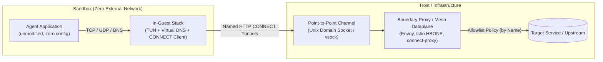
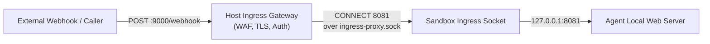
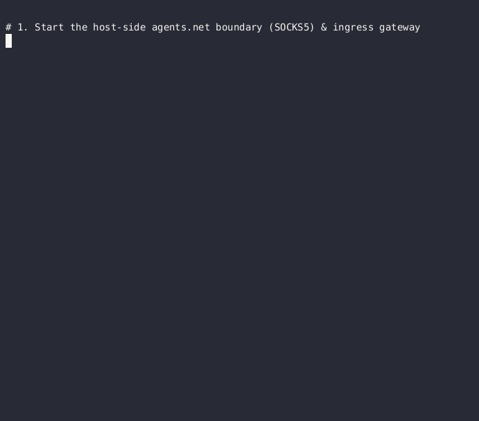

# AGENTS.NET: Standardized Agent Networking Specification

`agents.net` is an open specification for giving sandboxed AI agents controlled network access. The idea is simple: the sandbox has no network at all, every connection the agent makes leaves through a single socket as a named HTTP `CONNECT` tunnel, and a proxy on the host decides — by destination name — what is allowed. The agent doesn't need to cooperate or even know about any of this, and the host side can be an off-the-shelf dataplane like Envoy. No proxy configuration in the guest, no IP management on the host, and everything fails closed.

---

## 1. Motivation & Sandbox Definition

### What is a Sandbox?
In this specification, a **Sandbox** is an isolated execution environment containing an AI agent or untrusted workload that has **no direct access to external host networks**. Examples include:
- A Linux container configured with an unshared, empty network namespace (e.g. `docker run --network none` or isolated Kubernetes Pods).
- A microVM (such as Firecracker or Cloud-Hypervisor) provisioned without a routed TAP/NIC device.
- A process-isolated sandbox (such as gVisor or WebAssembly runtime) lacking direct host socket access.

Inside the sandbox, the application **MUST NOT be required to cooperate with its confinement**:
- Client libraries that initialize with `trust_env=False` or bypass `HTTP_PROXY` environment variables must still be confined.
- Subprocesses that clear or override their environment variables must not escape isolation.
- Non-HTTP protocols (raw TCP sockets, gRPC, database drivers, SSH/Git) must be handled uniformly without bespoke proxies per protocol.

### The Problem with Traditional Approaches
1. **Voluntary Proxy Conventions Fail:** Relying on environment variables (`HTTP_PROXY`, `ALL_PROXY`) depends entirely on the agent's voluntary compliance. Any subprocess, static binary, or custom network client can bypass the proxy.
2. **Host Routing and IPAM are Fragile:** Standard container networks allocate virtual interfaces (veth pairs, TAP devices), assign IP subnets (IPAM), and route traffic through host-side iptables/nftables or eBPF. Because DNS resolution happens inside the guest, host firewalls only see raw destination IP addresses. Enforcing domain-based policies then requires fragile DNS snooping or complex transparent proxying, and misconfigured firewall rules risk failing open.

### The `agents.net` Solution
`agents.net` standardizes the boundary between the sandbox and the host. Outgoing traffic inside the sandbox is captured (typically via a virtual `tun` device) and translated into standard HTTP `CONNECT` tunnel requests over a point-to-point boundary stream (such as a Unix Domain Socket or vsock).



---

## 2. Specification & Core Interfaces

The key words "MUST", "MUST NOT", "REQUIRED", "SHALL", "SHALL NOT", "SHOULD", "SHOULD NOT", "RECOMMENDED", "NOT RECOMMENDED", "MAY", and "OPTIONAL" in this document are to be interpreted as described in BCP 14 (RFC 2119, RFC 8174).

### 2.1 Egress Boundary Interface (Enforced)

The Egress Boundary Interface defines how traffic leaves the sandbox:

1. **Named Tunnel Requests:** All outbound TCP connections originating within the sandbox MUST be delivered to the host boundary as HTTP `CONNECT` tunnel requests (RFC 9110 Section 9.3.6), where the request authority (`Host` / `:authority`) contains the target destination hostname and port (e.g. `CONNECT api.openai.com:443`).
2. **Name Preservation:** The in-guest networking layer MUST preserve the destination domain name. The boundary proxy MUST receive the destination name directly, rather than an arbitrary pre-resolved IP address.
3. **UDP Support via Extended CONNECT:** When UDP tunneling is supported, sessions MUST be encapsulated using extended CONNECT (`:protocol: connect-udp`, RFC 9298) with HTTP Datagram capsules (RFC 9297).
4. **Point-to-Point Transport:** Communication between the sandbox and the host boundary MUST use a dedicated point-to-point stream channel, such as a bind-mounted Unix Domain Socket or a virtual socket (vsock).
5. **Host-Side Enforcement:** The host boundary MUST evaluate destination names against authorization policy before dialing upstream.
6. **Explicit Refusals:** When a destination is denied, the host boundary MUST return an explicit refusal (HTTP `403 Forbidden` with a `Boundary-Reason` header). The in-guest stack MUST surface this refusal to the agent application as an immediate connection failure (such as `ECONNREFUSED` or a TCP reset), avoiding silent hangs.
7. **Fail-Closed by Design:** If the boundary proxy or point-to-point channel is unavailable, all sandbox network connections MUST fail immediately.

### 2.2 Extensibility, Identity, and Mesh Pluggability

HTTP `CONNECT` is a standard, extensible wire protocol that existing infrastructure already understands:

- **Request Headers & Metadata:** The in-guest client MAY attach HTTP headers to tunnel requests for telemetry, trace propagation (e.g. W3C Trace Context), and sandbox identification (e.g. `Sandbox-Id`).
- **Workload Identity via (m)TLS:** The boundary transport MAY be wrapped in TLS or mutual TLS (mTLS). In a service mesh environment, the sandbox presents a client certificate asserting a workload identity (such as a SPIFFE ID: `spiffe://cluster.local/ns/sandbox/sa/agent-123`). The host boundary audits and authenticates this identity directly from the transport session.
- **Native Mesh Dataplane Support:** Because HTTP CONNECT and HTTP/2 CONNECT are standard proxy primitives, the boundary role can be fulfilled directly by an off-the-shelf [Envoy proxy](tun2connect/examples/envoy-boundary.yaml), an Istio ambient waypoint/sidecar (HBONE), or a standard Kubernetes API gateway.

### 2.3 TLS Inspection & Verification Models

The host boundary proxy can inspect and validate TLS traffic at different levels depending on security requirements:

#### A. Passive TLS Handshake Peeking (No Decryption / Zero-CA)
Without decrypting the payload or requiring CA certificates inside the guest, the boundary proxy can inspect the initial unencrypted TLS `ClientHello` frame (e.g. using Envoy's `tls_inspector` listener filter or standard socket buffer peeking):
- **SNI Validation & Anti-Spoofing:** The boundary verifies that the Server Name Indication (SNI) matches the destination host declared in the HTTP `CONNECT` authority, preventing domain-fronting and SNI mismatch attacks.
- **Protocol & Cipher Inspection:** Inspects ALPN protocol negotiation (e.g., verifying `h2` vs `http/1.1`) and client TLS fingerprints (JA3/JA4) for anomaly detection.
- **Zero Guest Configuration:** Requires no CA installation or trust store modification inside the sandbox while preserving end-to-end encryption to the upstream destination.

#### B. Full TLS Termination / Forward Proxy MITM (Layer 7 Inspection)
When an operator requires Layer 7 visibility (e.g. for credential injection, compliance auditing, Data Loss Prevention, or structured agent instructions):

1. **Root CA Mounting:** The host mounts a trusted Root CA certificate into the sandbox:
   ```bash
   AGENT_CA_CERT=/var/run/agent-ca.pem
   ```
2. **Trust Store Coordination:** The sandbox environment SHOULD map `AGENT_CA_CERT` to standard runtime environment variables:
   - `REQUESTS_CA_BUNDLE=$AGENT_CA_CERT`
   - `SSL_CERT_FILE=$AGENT_CA_CERT`
   - `NODE_EXTRA_CA_CERTS=$AGENT_CA_CERT`
3. **Capabilities Enabled:**
   - **Host-Side Credential Injection:** The agent sends requests with empty or placeholder credentials; the host boundary intercepts the request, strips dummy tokens, and injects real provider API keys (`Authorization: Bearer <token>`) managed exclusively on the host.
   - **Data Loss Prevention (DLP) & Auditing:** Real-time inspection and redaction of prompt payloads, tools, and response bodies.
   - **In-Band Agent Signaling:** The boundary can return structured HTTP headers (e.g. `X-Agent-Instruction`, rate limit `Retry-After`, or descriptive `403 Forbidden` error bodies) that AI agents can parse and react to.
4. **Coordination Semantics:** This is an opt-in coordination convention. If an application ignores `AGENT_CA_CERT`, its connections to TLS-inspected domains will fail TLS certificate validation, while uninspected domains and all boundary enforcement rules remain fully intact.

### 2.4 Ingress Interface (Inbound Traffic)

To allow an isolated sandbox to receive external webhooks, OAuth callbacks, or prompts without exposing host network ports:



1. **Host Ingress Gateway:** The host listens on an external port, terminates public TLS, enforces payload limits, and acts as a reverse proxy.
2. **Reverse Stream Channel:** An ingress stream channel (`ingress-proxy.sock` or vsock port) is provided inside the sandbox. When an external request arrives, the host connects to this channel using a stream handshake (`CONNECT <port>\n` -> `OK\n` or standard HTTP CONNECT).
3. **Loopback Forwarding:** The in-guest listener forwards the incoming stream to the agent's local web server listening on loopback (`127.0.0.1:$AGENT_INGRESS_PORT`).
4. **Coordination Variables:** The agent specifies its listening port and public callback URL via environment variables:
   ```bash
   AGENT_INGRESS_PORT=8081
   AGENT_PUBLIC_URL=https://agents.example.com/callbacks/agent-123
   ```

---

## 3. Architecture Benefits

| Benefit | Description |
|---|---|
| **Zero Host IPAM** | No IP address management, subnet allocations, veth pairing, or NAT tables required on the host. |
| **Fail-Closed & Safe** | The sandbox has no external network interfaces. If the launcher or boundary stops, network access is completely severed. |
| **Name-Preserving Policy** | Host boundaries make authorization decisions based on destination domain names rather than ephemeral IP addresses. |
| **Tenant CPU Accounting** | Network packet processing and TCP/IP stack execution occur inside the guest, billing CPU time to the tenant sandbox instead of host system processes. |
| **Standard Mesh Integration** | Compatible with standard cloud-native dataplanes (Envoy, Istio HBONE, forward proxies) without bespoke protocol adapters. |
| **Extensible & Auditable** | Tunnels carry structured headers for audit trails, policy block reasons, and cryptographic workload identities (SPIFFE). |

---

## 4. Security Model & Trust Boundaries

The security of this design comes from how the sandbox is built, not from filtering rules. That has a few consequences worth spelling out.

### 4.1 There Are No Firewall Rules to Get Wrong

Traditional setups enforce network policy through kernel configuration: iptables/nftables rule sets, routing tables, or attached eBPF programs. Every rule is something that can be missing, wrong, or changed at runtime — and a mistake usually means an open network path, not a broken one.

In `agents.net` the sandbox simply has no network to begin with. Isolation comes from how the sandbox is created (an empty network namespace, or a microVM without a NIC), so:

- There are no firewall rules, routes, or NAT entries to misconfigure. There is no network to filter.
- Changing network settings inside the guest — routes, DNS, the tun device — can only break connectivity. It can never open a new path, because the only way out is the boundary socket, and the policy check happens on the other side of it.
- Everything runs in ordinary userspace processes. Enforcement needs no kernel modules, no `CAP_BPF`, and no `CAP_NET_ADMIN` on the host.

### 4.2 The In-Guest Proxy Is Not Trusted

The launcher, the TUN device, and the virtual DNS exist for compatibility: they give unmodified applications a working socket API. They are not what enforces policy, and nothing depends on trusting them:

- **If the agent kills the launcher**, the sandbox loses its network. It fails closed, never open.
- **Taking over the TUN gains nothing.** A `tun` interface is just a file descriptor owned by the process that opened it — there is no host dataplane behind it. When the launcher dies, the interface disappears with it, and an agent that opens its own TUN only receives its own packets back.
- **Bypassing the launcher gains nothing either.** An agent is free to speak HTTP `CONNECT` directly on the boundary socket; it will still only reach what host policy allows.
- **A fully compromised guest stack** can, at worst, open tunnels to destinations that are already on the allowlist. It can pick among the permitted names; it cannot add new ones. SNI cross-checking (Section 2.3.A) also makes it hard to lie about the name on TLS flows.

#### How is this different from a transparent redirect (TPROXY)?

A reasonable objection: in a transparent-redirect design (guest NAT rules → local forwarder → vsock), the agent can also kill the in-guest pieces — so aren't the risks the same? For guest compromise, yes. Neither design trusts the in-guest process, and as long as the redirect has nothing but a vsock behind it, both fail closed. (With a routed NIC behind the rules it's a different story: tampering with the rules gives direct network access, which is fail-open.)

The real difference is what the policy gets to see:

- With CONNECT, there is no way to express a flow without a name. Whether the request comes from the real launcher or from the agent imitating it, the boundary receives `CONNECT name:port` and rejects IP literals. The name-based policy input is guaranteed by the protocol itself, not by trusting the guest.
- With a transparent redirect, the wire carries an IP and port (`SO_ORIGINAL_DST`). Names have to be recovered from SNI or Host headers, or from a DoH resolver the operator also has to run — and flows that are neither TLS nor HTTP have no name at all. A compromised agent can dial raw IPs and force the policy to reason about IP reputation instead.

There are smaller practical differences too: no netfilter rules or iptables tooling in the guest image, `CAP_NET_ADMIN` can be dropped once the TUN exists, and the same dataplane works in containers, microVMs, and gVisor (whose guest sockets are invisible to host eBPF/TPROXY hooks).

### 4.3 What Actually Has to Be Trusted

That leaves two components that security really depends on:

1. **The isolation primitive** — the network namespace or hypervisor boundary that guarantees there is no other way out. This is a mature, heavily audited kernel mechanism, the same one every container and VM already relies on.
2. **The host boundary proxy** — the single place where policy is enforced. Its integrity is the critical dependency, and the design keeps it easy to defend:
   - It runs as a normal unprivileged process — no root, no `CAP_NET_ADMIN`. Both reference boundaries ([connect-proxy](tun2connect/cmd/connect-proxy/main.go) and [host_proxy.py](demo/host_proxy.py)) run as a regular user.
   - It can be small enough to audit by hand (the demo boundary is one Python file using only the standard library), or it can be a hardened, widely deployed dataplane like Envoy instead of custom code.
   - The file permissions on the boundary socket are part of the trust boundary: they decide which processes can connect at all.

### 4.4 Attesting the Guest

Since the guest stack is untrusted, a compromised or imitated launcher doesn't get extra reach. What it does threaten is **identity and audit quality**: if the agent can read the mTLS key, it can present the workload identity itself, and headers like `Sandbox-Id` can be forged. The honest way to state the guarantee is: **a workload identity vouches for the sandbox as a whole, not for the code inside it — unless the key is tied to a measured launch.** Depending on how strong a guarantee a deployment needs, there are well-known techniques at increasing cost, and none of them require changing the wire (certificates are opaque to the protocol):

| Level | Technique | What it buys you |
|---|---|---|
| 0 | **Boundary-side checks** (SNI vs CONNECT authority, ALPN conformance, JA3/JA4 fingerprints) | Catches a guest lying about names on TLS flows. Needs no trust in the guest at all. |
| 1 | **Privilege separation inside the guest** (different UIDs for launcher and agent, non-root agent with `no_new_privs`/seccomp, separate PID namespaces) | The agent can't read the launcher's key or ptrace it. It can still send traffic *through* the sandbox identity, but it can't steal the key. |
| 2 | **Workload attestation** (SPIFFE/SPIRE with binary-hash selectors) | The identity is only issued to a process whose binary hash matches the real launcher, so an imitation never gets credentials. |
| 3 | **Measured boot + read-only rootfs** (vTPM quotes, `dm-verity`, IMA/Keylime; microVMs) | The launcher that booted is provably the expected binary and can't be swapped afterwards. |
| 4 | **Confidential computing / attested TLS** (AMD SEV-SNP, Intel TDX via cloud-hypervisor/QEMU/Kata) | The hardware signs the launch measurement and ties it to the TLS key, so the boundary knows it is talking to the measured stack before accepting the session. |

### 4.5 Residual Risks

Putting all enforcement in one place is a strength — there is one component to verify — but also a concentration of risk: whoever compromises the boundary process controls policy and any credentials it injects. Deployments SHOULD use narrowly scoped per-sandbox tokens, run separate boundary instances per tenant where isolation demands it, and keep in mind that allowlisted destinations remain a data-exfiltration path: the mechanism controls *where* an agent can talk, but only good policy limits what that is worth.

---

## 5. Implementation Patterns

While the specification defines the boundary protocol and contracts, implementations can adopt different in-guest architectures depending on the virtualization technology:

### 5.1 In-Guest Networking with TUN and Virtual DNS
A common and portable implementation pattern uses a userspace TCP/IP stack (such as gVisor `netstack` or `tun2socks`) attached to a virtual `tun` device:

1. **TUN Interface:** A `tun` interface (e.g. `tun0`) is created inside the sandbox and configured as the default gateway.
2. **Virtual DNS (Name Preservation):** The in-guest stack intercepts local DNS queries on port 53. Instead of resolving them over the network, it returns a synthetic IP address allocated from a private pool (e.g., IPv4 `100.64.0.0/10` and IPv6 `100::/64`).
3. **Dial-Time Reverse Lookup:** When the agent initiates a connection to a synthetic IP, the userspace stack resolves the IP back to the original domain name, opens the boundary stream, and sends an HTTP `CONNECT` request with the destination name. Any connection to an unrecognized synthetic IP is rejected before dialing the boundary.

### 5.2 Process Supervision & Lifecycle Models

The supervision model for the in-guest networking process depends on the host virtualization environment. Running as **PID 1 is recommended where applicable, but not required**:

- **Container Entrypoint Injection (Recommended for Containers):** The launcher binary (e.g. `nano-init`) is bind-mounted into the container and set as `--entrypoint`. It executes as PID 1, initializes the `tun` device, runs the agent process as a child, reaps orphans, forwards signals, and exits with the agent's return code. This provides tight lifecycle coupling: if the launcher dies, the sandbox terminates.
- **Sidecar Process / Shared Network Namespace:** In environments where the container entrypoint must remain untouched (or in Kubernetes pods), the launcher can run as a sidecar process sharing the sandbox network namespace. If the sidecar terminates, the agent simply loses network access (failing closed).
- **MicroVM Guest Init / System Daemon (MicroVMs):** In microVMs (Firecracker, Cloud-Hypervisor), the networking daemon (e.g. `tun2connect`) runs as a standard guest init process (`/sbin/init`) or system service communicating over a vsock channel to the host.

---

## 6. Decision Matrix: Architectural Comparison

The table below summarizes the trade-offs between `agents.net` and other sandboxing approaches:

| Dimension | 1. Routed NIC + Firewall<br/>(veth/tap + nftables/eBPF) | 2. Proxy Environment Variables<br/>(`HTTP_PROXY` + CA vars) | 3. Host-Side Userspace Stack<br/>([gvisor-tap-vsock](https://github.com/containers/gvisor-tap-vsock)) | 4. Guest Userspace Stack<br/>(tun → HTTP CONNECT, **agents.net**) | 5. Socket-Layer eBPF<br/>(cgroup connect hooks / sockmap) | 6. In-Guest Redirect over vsock<br/>(NAT → forwarder → vsock) |
|---|---|---|---|---|---|---|
| **Enforcement** | Filter over a working network | Voluntary client cooperation | Host processes all guest frames | Sandbox has no network interface except tun | Shared host kernel only | vsock is only route; guest rules handle routing |
| **Failure Mode** | Fail-open (missing rule leaves network open) | Fail-open (client ignores env) | Fail-closed | Fail-closed (launcher exit terminates sandbox) | Fail-closed if default-deny; probes can detach | Fail-closed (tampered guest rules break routing) |
| **Policy Visibility** | Destination IP and port | Full URL (HTTP/HTTPS only) | Raw packets; names require full guest DNS proxy | **Destination hostname for every flow** | IP:port at socket `connect()` | IP:port via `SO_ORIGINAL_DST`; names inferred from SNI/Host |
| **Guest Requirements** | None | Runtime-specific env variables | None (guest sees standard NIC) | In-guest stack (tun + userspace dialer) | None | Guest NAT rules + forwarder + local DNS resolver |
| **Host Overhead** | netns, veth pairs, IPAM, routing rules, `CAP_NET_ADMIN` | None | Full TCP/IP stack + NAT/DHCP/DNS in host process | One proxy listener per boundary socket | eBPF program management, `CAP_BPF` / `CAP_SYS_ADMIN` | Per-sandbox proxy listener + configuration daemon |
| **CPU Accounting** | Host kernel | N/A | Billed to host process | **Billed to sandbox cgroup / VM** | Host kernel | Sandbox (guest kernel) |
| **VM / Container Portability** | Different implementations | Consistent where supported | VM-focused | Identical byte stream (Unix socket ↔ vsock) | Container only (cannot cross VM boundary) | MicroVM-focused |
| **Protocol Support** | All | HTTP(S) only | All | TCP & UDP (via `connect-udp`) | TCP & UDP | TCP only |

---

## 7. Reference Implementations

This repository provides two reference implementations demonstrating the specification:

### 7.1 Standard Wire Implementation: [tun2connect/](tun2connect/)
A modular Go implementation (`github.com/aojea/agents.net/tun2connect`) of the HTTP CONNECT boundary wire:

- [tun2connect/pkg/tun2connect/engine.go](tun2connect/pkg/tun2connect/engine.go) — Userspace gVisor netstack engine connecting TUN devices to HTTP CONNECT dialers.
- [tun2connect/pkg/tun2connect/dns.go](tun2connect/pkg/tun2connect/dns.go) — Virtual DNS implementation with synthetic IP allocation and dial-time name reversal.
- [tun2connect/pkg/tun2connect/dialer.go](tun2connect/pkg/tun2connect/dialer.go) — `Dialer` interface supporting HTTP/1.1 (`BoundaryClient`) and HTTP/2 (`BoundaryClientH2`).
- [tun2connect/cmd/connect-proxy/main.go](tun2connect/cmd/connect-proxy/main.go) — Reference host boundary proxy with domain allowlisting, HTTP/1.1 and multiplexed HTTP/2 support, UDP capsule tunneling, and mTLS client certificate verification.
- [tun2connect/cmd/tun2connect/main.go](tun2connect/cmd/tun2connect/main.go) — Standalone in-guest daemon establishing tunnels over a boundary socket.
- [tun2connect/examples/envoy-boundary.yaml](tun2connect/examples/envoy-boundary.yaml) — Production Envoy configuration terminating both HTTP/1.1 and HTTP/2 CONNECT tunnels natively.
- [tun2connect/test_envoy.sh](tun2connect/test_envoy.sh) — Test script validating end-to-end Envoy interoperability.

### 7.2 Zero-Network Sandbox Demo: [demo/](demo/)
A hands-on, runnable demonstration of a zero-network autonomous ReAct agent running inside Docker:



- [demo/README.md](demo/README.md) — Step-by-step tutorial for building and running the sandbox.
- [demo/host_proxy.py](demo/host_proxy.py) — Python host boundary implementing a 4-tier allowlist (fake responses, local Ollama relay, cloud credential injection, and uninspected passthrough).
- [demo/agent.py](demo/agent.py) — Sample ReAct agent demonstrating autonomous reasoning, tool execution, and handling connection refusals.
- [demo/gen_certs.sh](demo/gen_certs.sh) — Script to generate demo root CA and multi-SAN leaf certificates.
- [demo/Dockerfile](demo/Dockerfile) — Standard Debian-based container image definition for the agent.
- [demo/test_demo.sh](demo/test_demo.sh) — Presubmit script verifying fail-closed isolation, TLS fake responses, and ingress webhooks.


