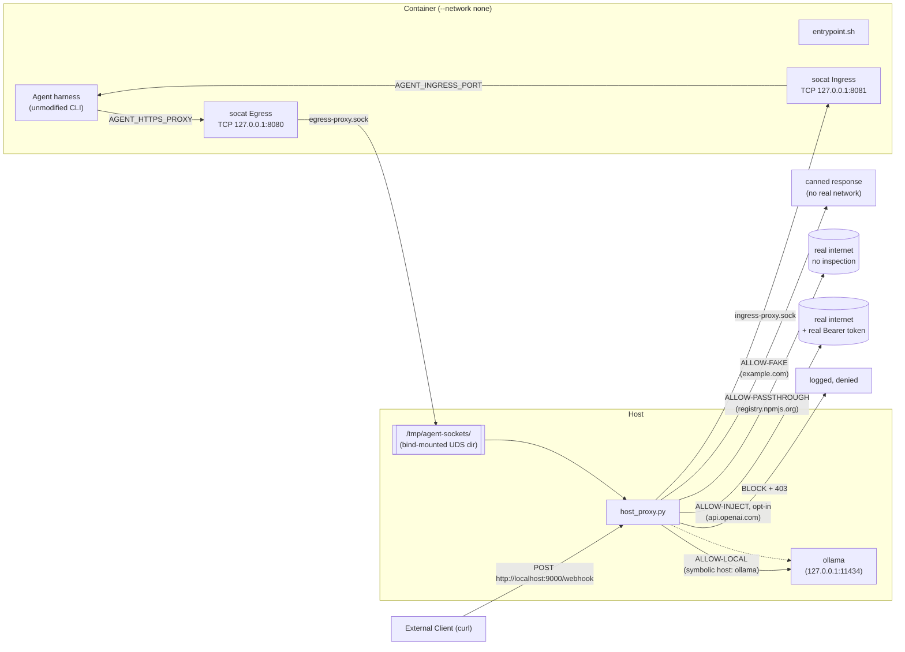

# agents.net the Hard Way

Bootstrap a Zero-Network Sandbox from scratch, one command at a time.

This tutorial walks through the [agents.net](../README.md) reference implementation end to end. By the end you will have run a real, unmodified, off-the-shelf agent CLI inside a container with **`--network none`**, and watched it handle bidirectional traffic (egress via an `HTTP CONNECT` proxy + ingress webhooks via an API Gateway) over Unix sockets.

Read the [agents.net specification](../README.md) first for the *why* (the Proxy Contract, the Trust Contract, and the Ingress Contract). This doc is the *how*.

Everything here runs against a free, local model server ([Ollama](https://ollama.com)) by default, so you can work through the whole tutorial without a paid API key or a dependency on any single model provider. A final section shows how to point the exact same image at a real hosted provider instead, using the same credential-injection contract rather than a key baked into the image.

## Target Audience

This tutorial is for engineers building or evaluating sandboxes for autonomous agents, who want to see the "ACLs + Proxies, not a routed network" architecture actually run, rather than just read about it.

## What You'll Build



Four allow-list tiers, enforced entirely on the host side, with the container never holding a routable network interface or a real secret.


## Prerequisites

- Docker
- `openssl`, `sh`/`bash`, `python3` (no third-party Python packages required -- `host_proxy.py` only uses the standard library)
- [Ollama](https://ollama.com) running as a normal (non-sandboxed) container on the host, published to loopback only -- see Lab 1. No paid API key, no account, no vendor lock-in.

All commands below are run from the repository root unless noted otherwise.

## Lab 1: Start the Local Model Provider (Ollama)

The agent harness needs a model to talk to. Run Ollama as an ordinary Docker container -- it is **not** part of the sandbox and has completely normal networking; only the host proxy will ever talk to it on the sandbox's behalf:

```bash
docker run -d --name ollama \
  -p 127.0.0.1:11434:11434 \
  -v ollama_data:/root/.ollama \
  ollama/ollama:latest

docker exec ollama ollama pull qwen2.5:0.5b
```

`-p 127.0.0.1:11434:11434` publishes Ollama to the host's loopback interface only -- not to the LAN, and not on a Docker network shared with the sandbox. The sandboxed container will never be able to reach it directly (it has no network interface at all); only `host_proxy.py`, running with normal host networking, dials `127.0.0.1:11434` on the sandbox's behalf. This is the same "the proxy holds the thing the sandbox isn't trusted with" pattern as `CREDENTIAL_HOSTS`, just with a real address instead of a real secret.

`qwen2.5:0.5b` (397 MB) is lightweight and fast, making the reference demo easy to run on any laptop without heavy memory requirements. Larger models can also be specified in [agent.py](agent.py) and [Dockerfile](Dockerfile) if desired.

**Verify:**

```bash
curl -s http://127.0.0.1:11434/api/tags | grep qwen2.5
```

## Lab 2: Generate the Demo Certificate Authority

The host proxy terminates TLS locally for its fake-response tier, so it needs its own root CA and a leaf certificate. [gen_certs.sh](gen_certs.sh) generates both:

```bash
./demo/gen_certs.sh
```

This creates:

- `demo/certs/agent-ca.pem` / `agent-ca.key` — the demo root CA. `agent-ca.pem` is what gets mounted into the sandbox as `AGENT_CA_CERT` to fulfill the Trust Contract.
- `demo/certs/agent-mitm.pem` / `agent-mitm.key` — a single leaf certificate with a `SAN` entry per host the proxy needs to terminate TLS for (`example.com` by default).

A single cert with multiple exact `SAN` entries is used instead of a wildcard: `*.example.com` matches one subdomain label and never the bare apex `example.com` itself. Since this is a private demo CA (not bound by public CA/Browser-Forum wildcard rules), listing exact hostnames is simpler and fully general -- pass extra hostnames as arguments to cover more, e.g. `./demo/gen_certs.sh api.openai.com` (needed later, only for the cloud-migration bonus). The local-provider tier (Ollama) needs no `SAN` entry at all -- it's a plain, un-terminated HTTP relay.

**Verify:**

```bash
openssl x509 -in demo/certs/agent-mitm.pem -noout -text | grep -A1 "Subject Alternative Name"
```

Expected output includes `DNS:example.com`.

## Lab 3: Understand and Start the Host Proxy

[host_proxy.py](host_proxy.py) is the entire enforcement point. It binds a Unix Domain Socket, speaks `HTTP CONNECT`, and enforces a four-tier allow-list:

| Tier | Example hosts | What happens | Configured via |
|---|---|---|---|
| **Fake-response** | `example.com` | Never forwarded. TLS terminated locally with the demo CA; a canned success body is returned. | `FAKE_RESPONSE_HOSTS` (hardcoded to the demo's task target) |
| **Local-provider** | `ollama` (symbolic) | No TLS termination, no credential. A plain byte relay from the sandbox's symbolic hostname to a real `host:port` on the operator's own machine -- the sandbox can never resolve or route to it on its own. | `AGENT_PROXY_LOCAL_PROVIDERS="symbolic=host:port,..."` (default `ollama=127.0.0.1:11434`) |
| **Passthrough** | `registry.npmjs.org` | No TLS termination, no injection -- a plain byte-for-byte relay straight to the real host. Used for a harness's own housekeeping (package installs, update checks, telemetry) that carries no secret. | `AGENT_PROXY_PASSTHROUGH="host,host,..."` (default `registry.npmjs.org`) |
| **Credential-inject**, opt-in | `api.openai.com` | TLS terminated locally, the agent's `Authorization` header (empty, placeholder, or garbage) is stripped and replaced with the real `Bearer <token>`, then genuinely relayed upstream with the real system trust store. Empty/unconfigured by default -- see the cloud-migration section at the end of this tutorial. | `AGENT_PROXY_TOKENS="host=ENV_VAR_NAME,..."` |

Anything not on any of the four lists is **blocked** and logged, and the agent is sent a normal HTTP `403` explaining why -- in-band signaling instead of a silent hang.

Start the proxy on the host. For the local-only demo in this tutorial, no credentials are needed at all:

```bash
python3 demo/host_proxy.py
```

**Verify** -- the startup banner should show all four allow-lists:

```
[*] Host Proxy listening on: /tmp/agent-proxy.sock
[*] Fake-response allow-list: ['example.com']
[*] Local-provider allow-list: {'ollama': ('127.0.0.1', 11434)}
[*] Credential-inject allow-list: {}
[*] Passthrough allow-list: ['registry.npmjs.org']
[*] Audit log: /tmp/agent-proxy-audit.log
```

An empty `Credential-inject allow-list: {}` is expected and correct here -- that tier is opt-in, for the cloud-migration bonus later. Leave the proxy running in this terminal (or run it under `&`/a separate pane) for the rest of the tutorial.

## Lab 4: Inspect the Sandbox Bridge

[entrypoint.sh](entrypoint.sh) is what runs *inside* the container. It does three things, in order:

1. Bridges the mounted Unix Domain Socket back to a local TCP port with `socat`, since most HTTP clients don't speak CONNECT-over-UDS directly.
2. Exports the canonical `AGENT_HTTP_PROXY` / `AGENT_HTTPS_PROXY` / `AGENT_NO_PROXY` contract variables. It does **not** export the conventional `HTTP_PROXY`/`http_proxy` by default -- the agent has to discover the `AGENT_*` variables itself.
3. If `AGENT_NET_LEGACY_COMPAT=1`, additionally exports `HTTP_PROXY`/`HTTPS_PROXY`/`NO_PROXY` (and lowercase aliases), for tools that only honor the conventional names. If a CA is mounted at `/var/run/agent-ca.pem`, it also wires up `AGENT_CA_CERT`, `REQUESTS_CA_BUNDLE`, `NODE_EXTRA_CA_CERTS`, and `SSL_CERT_FILE`.

No changes are needed here for this tutorial -- just read it once so Lab 6's behavior isn't a surprise. Notably, the Python ReAct agent harness ([agent.py](agent.py)) uses standard Python libraries (`requests` / `urllib`) that natively honor these conventional variable names, so `AGENT_NET_LEGACY_COMPAT=1` enables zero-code-change proxying.

## Lab 5: Build the Sandbox Image

[Dockerfile](Dockerfile) installs Python dependencies, copies in the demo's [agent.py](agent.py) harness, and wires `entrypoint.sh` as the container's `ENTRYPOINT`:

```bash
docker build -t agentsnet-demo demo/
```

**Verify:**

```bash
docker run --rm --network none agentsnet-demo python3 /demo/agent.py
```

This should run the agent harness cleanly inside the container.

## Lab 6: Run the Agent With No Network Interface

Run the container with networking explicitly disabled, the demo CA mounted read-only, and the host proxy's socket bind-mounted in:

```bash
docker run --rm \
  --network none \
  -v /tmp/agent-proxy.sock:/var/run/agent-proxy.sock \
  -v "$(pwd)/demo/certs/agent-ca.pem:/var/run/agent-ca.pem:ro" \
  -e AGENT_NET_LEGACY_COMPAT=1 \
  agentsnet-demo
```

Notice there is no `-e` flag carrying any kind of API key.

The container has no `eth0`, no routing table entry beyond loopback, and no DNS resolver configuration pointing anywhere real -- yet the Python ReAct agent will complete the task ("fetch `https://example.com` and report its content") purely through the mounted socket and CA.

## Lab 7: Read the Audit Trail

While (or after) Lab 6 runs, tail the audit log on the host:

```bash
tail -f /tmp/agent-proxy-audit.log
```

A representative run looks like this:

```
2026-07-25T09:10:52.910212+00:00 ALLOW-FAKE CONNECT example.com:443
2026-07-25T09:10:53.120300+00:00 ALLOW-FAKE GET http://example.com
```

Reading it line by line:

- **`ALLOW-FAKE CONNECT example.com:443`** -- TLS handshake terminated locally by the host proxy.
- **`ALLOW-FAKE GET http://example.com`** -- the demo's task target, answered locally with a canned response, never touching the real internet.

Because the image's `CMD` is just a normal non-interactive invocation, the same image and bridge can be reused for a harder follow-up exercise later by overriding the `docker run` command with a different prompt, no rebuild required.

## Troubleshooting

**`BLOCK CONNECT` lines for hosts you didn't expect**
This is the ACL working as designed. Two options, both valid:
- Leave it blocked. This is the "unexpected-egress visibility" the architecture is meant to provide.
- Add the host to `AGENT_PROXY_PASSTHROUGH` (comma-separated) when starting `host_proxy.py`.

**`[!] no demo MITM cert (run gen_certs.sh) -- blocking`**
Lab 3 was started before Lab 2 completed. Run `./demo/gen_certs.sh` and restart `host_proxy.py`.

**`AGENT_PROXY_TOKENS: '<VAR>' is not set on the host -- '<host>' will NOT be reachable`**
Only relevant for the cloud-migration section above -- fails closed by design. Export the referenced environment variable in the *host's* shell (not the container's) before starting `host_proxy.py`.

**Container hangs with no output**
Confirm the UDS bind mount path matches where `host_proxy.py` is actually listening (`/tmp/agent-proxy.sock` by default) and that the proxy process is still running on the host.

## Automated Testing

Run unit tests and the end-to-end sandbox presubmit test locally:

```bash
./demo/test_demo.sh
```

This automated suite runs:
1. Python unit tests for `host_proxy.py` logic.
2. Certificate generation (`gen_certs.sh`).
3. Container build (`docker build`).
4. Harness version check in a `--network none` container.
5. Proxy execution and verification of `AGENT_HTTP_PROXY` + `AGENT_CA_CERT` TLS termination.
6. ACL blocking and HTTP 403 response verification.
7. Host proxy audit trail log verification.

This suite also runs automatically on GitHub Actions presubmit for all pull requests and pushes to `main`.

## Cleanup

```bash
# Stop the host proxy (Ctrl+C if run in the foreground, or):
pkill -f demo/host_proxy.py

rm -f /tmp/agent-proxy.sock /tmp/agent-proxy-audit.log
docker rm -f ollama
docker volume rm ollama_data
docker rmi agentsnet-demo
```

