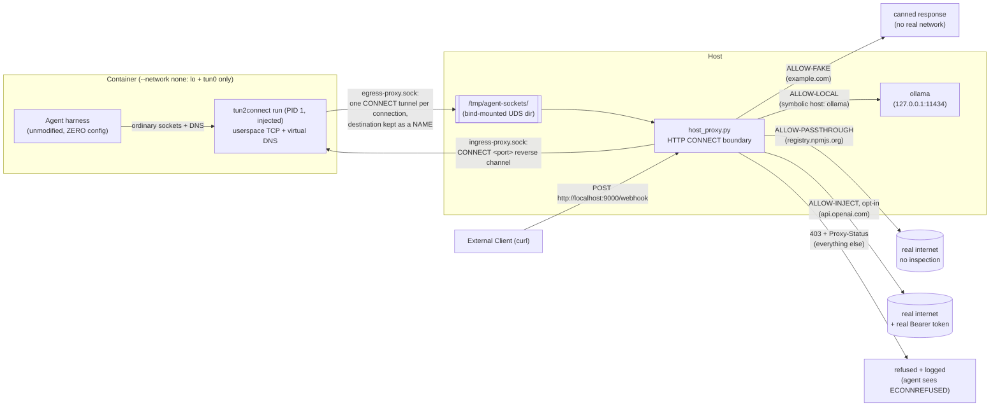

# agents.net the Hard Way

Bootstrap a Zero-Network Sandbox from scratch, one command at a time.

This tutorial walks through the [agents.net](../README.md) reference implementation ([sdk/](../sdk/README.md)) end to end. By the end you will have run a real, unmodified agent harness inside a container with **`--network none`**, confined by a launcher injected at `docker run` time, and watched every flow it makes cross a single Unix socket as a named HTTP `CONNECT` tunnel -- [the spec's egress wire](../spec/draft/wire.md) -- where it is checked against policy and audited on the host. A bonus section at the end swaps the boundary for other CONNECT-terminating implementations, including an unmodified Envoy.

Read the [agents.net specification](../spec/draft/index.md) first for the *why* (the sandbox definition, the egress boundary interface, the TLS inspection models, the ingress interface, the security model, and the decision matrix). This doc is the *how*.

Everything here runs against a free, local model server ([Ollama](https://ollama.com)) by default, so you can work through the whole tutorial without a paid API key or a dependency on any single model provider. A final section shows how to point the exact same image at a real hosted provider instead, using the same credential-injection tier rather than a key baked into the image -- with no rebuild and no change to the run command.

## Target Audience

This tutorial is for engineers building or evaluating sandboxes for autonomous agents, who want to see the "a route and a socket, not a routed network" architecture actually run, rather than just read about it.

## What You'll Build



Four allow-list tiers, enforced entirely on the host side, decided on destination *names*, with the container never holding a routable network interface, a resolvable DNS path, or a real secret. The image knows nothing about agents.net; the launcher is injected at run time (the spec's recommended entrypoint injection).


## Prerequisites

- Docker
- `openssl`, `sh`/`bash`, `python3` (no third-party Python packages required -- `host_proxy.py` only uses the standard library)
- Go (or just Docker: Lab 3 shows both ways to build the launcher)
- [Ollama](https://ollama.com) running as a normal (non-sandboxed) container on the host, published to loopback only -- see Lab 1. No paid API key, no account, no vendor lock-in.

All commands below are run from the repository root unless noted otherwise.

## Lab 1: Start the Local Model Provider (Ollama)

The agent harness needs a model to talk to. Run Ollama as an ordinary Docker container -- it is **not** part of the sandbox and has completely normal networking; only the host boundary will ever talk to it on the sandbox's behalf:

```bash
docker run -d --name ollama \
  -p 127.0.0.1:11434:11434 \
  -v ollama_data:/root/.ollama \
  ollama/ollama:latest

docker exec ollama ollama pull qwen2.5:0.5b
```

`-p 127.0.0.1:11434:11434` publishes Ollama to the host's loopback interface only -- not to the LAN, and not on a Docker network shared with the sandbox. The sandboxed container will never be able to reach it directly (it has no network interface at all); only `host_proxy.py`, running with normal host networking, dials `127.0.0.1:11434` on the sandbox's behalf. This is the same "the boundary holds the thing the sandbox isn't trusted with" pattern as `CREDENTIAL_HOSTS`, just with a real address instead of a real secret.

`qwen2.5:0.5b` (397 MB) is lightweight and fast, making the reference demo easy to run on any laptop without heavy memory requirements. Larger models can also be specified in [agent.py](agent.py) and [Dockerfile](Dockerfile) if desired.

**Verify:**

```bash
curl -s http://127.0.0.1:11434/api/tags | grep qwen2.5
```

## Lab 2: Generate the Demo Certificate Authority

The host boundary terminates TLS locally for its fake-response tier, so it needs its own root CA and a leaf certificate. [gen_certs.sh](gen_certs.sh) generates both:

```bash
./demo/gen_certs.sh
```

This creates:

- `demo/certs/agent-ca.pem` / `agent-ca.key` — the demo root CA. The [Dockerfile](Dockerfile) bakes `agent-ca.pem` into the sandbox image's system trust store at build time (the trust-store coordination from the spec's [TLS inspection models](../spec/draft/gateway.md#1-tls-inspection-and-verification-models)), so run this lab **before** Lab 5.
- `demo/certs/agent-mitm.pem` / `agent-mitm.key` — a single leaf certificate with a `SAN` entry per host the boundary needs to terminate TLS for (`example.com` by default). The leaf never enters the image -- it lives host-side only, which is why adding TLS-inspected hosts later needs no rebuild.

A single cert with multiple exact `SAN` entries is used instead of a wildcard: `*.example.com` matches one subdomain label and never the bare apex `example.com` itself. Since this is a private demo CA (not bound by public CA/Browser-Forum wildcard rules), listing exact hostnames is simpler and fully general -- pass extra hostnames as arguments to cover more, e.g. `./demo/gen_certs.sh api.openai.com` (needed later, only for the cloud-migration bonus).

**Verify:**

```bash
openssl x509 -in demo/certs/agent-mitm.pem -noout -text | grep -A1 "Subject Alternative Name"
```

Expected output includes `DNS:example.com`.

## Lab 3: Build the Launcher

The launcher is this repo's [tun2connect](../sdk/) in its `run` mode: a dependency-free static binary that becomes PID 1, terminates the sandbox's TCP in userspace (gVisor), answers DNS with invented addresses, and opens one named HTTP `CONNECT` tunnel per flow on the boundary socket. Build it once:

```bash
CGO_ENABLED=0 go -C sdk build -o "$PWD/demo/tun2connect" ./cmd/tun2connect
```

(No Go toolchain on the host? Build it hermetically in a container instead:)

```bash
docker run --rm -v "$PWD":/src -w /src/sdk -e CGO_ENABLED=0 \
  golang:1.26 go build -o /src/demo/tun2connect ./cmd/tun2connect
```

**Verify** -- it is static (runs in any image, including scratch) and prints its usage:

```bash
file demo/tun2connect | grep "statically linked"
./demo/tun2connect run 2>&1 | head -2
```

## Lab 4: Understand and Start the Host Boundary

[host_proxy.py](host_proxy.py) is the demo enforcement point: an HTTP CONNECT
proxy on a Unix Domain Socket. Requests carry a hostname when the adapter has a
DNS mapping, or an IP address otherwise. This demo allows the hostnames in the
following tiers:

| Tier | Example hosts | What happens | Configured via |
| --- | --- | --- | --- |
| **Fake-response** | `example.com` | Never forwarded. TLS terminated locally with the demo CA; a canned success body is returned. | `FAKE_RESPONSE_HOSTS` (hardcoded to the demo's task target) |
| **Local-provider** | `ollama` (symbolic) | No TLS termination, no credential. A plain byte relay from the sandbox's symbolic hostname to a real `host:port` on the operator's own machine -- the sandbox can never resolve or route to it on its own. | `AGENT_PROXY_LOCAL_PROVIDERS="symbolic=host:port,..."` (default `ollama=127.0.0.1:11434`) |
| **Passthrough** | `registry.npmjs.org` | No TLS termination, no injection -- a plain byte-for-byte relay straight to the real host. Used for a harness's own housekeeping (package installs, update checks, telemetry) that carries no secret. | `AGENT_PROXY_PASSTHROUGH="host,host,..."` (default `registry.npmjs.org`) |
| **Credential-inject**, opt-in | `api.openai.com` | TLS terminated locally, the agent's `Authorization` header (empty, placeholder, or garbage) is stripped and replaced with the real `Bearer <token>`, then genuinely relayed upstream with the real system trust store. Empty/unconfigured by default -- see the cloud-migration section at the end of this tutorial. | `AGENT_PROXY_TOKENS="host=ENV_VAR_NAME,..."` |

Anything not on the four lists is refused with `403 Forbidden` and a
`Proxy-Status` field carrying the reason, and logged. The guest sees a connection failure. This
demo policy denies IP literals; that is not a protocol or adapter restriction.
The [Go boundary](../sdk/cmd/connect-proxy/main.go) accepts explicitly
authorized addresses and CIDRs through `ip` and `cidr` rules in its
[policy descriptor](../spec/draft/policy.md), and unlike this demo it
also resolves allowed hostnames itself and refuses non-public results.

Start the boundary on the host. For the local-only demo in this tutorial, no credentials are needed at all:

```bash
python3 demo/host_proxy.py
```

**Verify** -- the startup banner should show all four allow-lists:

```text
[*] Host Boundary (HTTP CONNECT) listening on: /tmp/agent-sockets/egress-proxy.sock
[*] Fake-response allow-list: ['example.com', 'httpbin.org']
[*] Local-provider allow-list: {'ollama': ('127.0.0.1', 11434)}
[*] Credential-inject allow-list: {}
[*] Passthrough allow-list: ['models.dev', 'registry.npmjs.org']
[*] Audit log: /tmp/agent-proxy-audit.log
```

An empty `Credential-inject allow-list: {}` is expected and correct here -- that tier is opt-in, for the cloud-migration bonus later. Leave the boundary running in this terminal (or run it under `&`/a separate pane) for the rest of the tutorial.

## Lab 5: Build the Sandbox Image

[Dockerfile](Dockerfile) installs the harness dependencies, copies in the demo's [agent.py](agent.py), and bakes the demo CA into the system trust store. Deliberately, it contains **no launcher, no proxy variables, no bridge scripts, no socket paths** -- the image knows nothing about agents.net:

```bash
docker build -t agentsnet-demo demo/
```

**Verify** -- run it *without* the launcher and watch the zero-network sandbox fail closed:

```bash
docker run --rm --network none agentsnet-demo
```

Every connection attempt fails immediately: no `eth0`, no route, no resolver. This is the starting point the launcher builds on -- the isolation comes from the runtime, not from a firewall rule -- and the launcher will now build the only way out of it.

## Lab 6: Run the Agent Behind the Injected Launcher

Now run it for real. The launcher is injected at run time (the spec's recommended **entrypoint injection**): the binary is bind-mounted read-only, `--entrypoint` wraps the image's command, and three flags provide what the [egress boundary interface](../spec/draft/wire.md#1-egress-boundary-interface) needs -- no network, a tun device, and the socket directory:

```bash
docker run --rm \
  --network none \
  --cap-add NET_ADMIN --device /dev/net/tun \
  -v /tmp/agent-sockets:/var/run/agents.net \
  -v "$(pwd)/demo/tun2connect:/tun2connect:ro" \
  --entrypoint /tun2connect \
  agentsnet-demo \
  run /var/run/agents.net/egress-proxy.sock \
  python3 /demo/agent.py "Fetch https://example.com and report its status code."
```

Note what is missing: no `-e` flag with an API key, **no proxy environment variables, no compatibility switches**. The harness runs exactly as it would on a normal network -- ordinary sockets, DNS and HTTP -- and is confined anyway. `tun2connect run` becomes PID 1, refuses to start if any interface besides loopback and its own tun exists, builds `tun0` as the only route, and delivers every flow to `host_proxy.py` as a named HTTP `CONNECT` tunnel.

The agent will resolve and call `ollama` (a name that exists nowhere but in the boundary's config), complete its task against `example.com` (answered locally with the canned response, trusted via the baked-in demo CA), and any other destination it tries is refused with a clean connection error.

## Lab 7: Read the Audit Trail

While (or after) Lab 6 runs, tail the audit log on the host:

```bash
tail -f /tmp/agent-proxy-audit.log
```

A representative run looks like this:

```text
2026-08-25T14:20:12.301442+00:00 ALLOW-LOCAL ollama:11434
2026-08-25T14:20:14.887210+00:00 ALLOW-FAKE example.com:443
2026-08-25T14:20:15.104332+00:00 BLOCK secret-vault.example:443
```

Reading it line by line:

- **`ALLOW-LOCAL ollama:11434`** -- the harness's model call, relayed to the operator's Ollama. The name `ollama` arrived intact through virtual DNS; only the boundary knows the real address.
- **`ALLOW-FAKE example.com:443`** -- the demo's task target, TLS terminated locally and answered with a canned response, never touching the real internet.
- **`BLOCK secret-vault.example:443`** -- deny-by-default at work: refused with `403` and a `Proxy-Status` reason, seen by the agent as a connection error, and recorded here. Each flow gets one decision and one log line.

Because the launched command is just a normal non-interactive invocation, the same image can be reused with a different prompt by changing the trailing arguments, no rebuild required.

## Lab 8 (Optional): Ingress -- Deliver a Webhook Into the Sandbox

Ingress uses a second Unix socket, served from *inside* the sandbox by the launcher. `--ingress-port` pins the one loopback port ingress streams may reach; the launcher refuses to start without it, and a handshake naming any other port is answered `ERR port not permitted`. Note that both flags must come **before** the boundary-socket argument: the launcher stops parsing flags at the first positional argument, so everything after it is passed to the agent untouched:

```bash
docker run --rm \
  --network none \
  --cap-add NET_ADMIN --device /dev/net/tun \
  -v /tmp/agent-sockets:/var/run/agents.net \
  -v "$(pwd)/demo/tun2connect:/tun2connect:ro" \
  --entrypoint /tun2connect \
  agentsnet-demo \
  run --ingress-socket /var/run/agents.net/ingress-proxy.sock --ingress-port 8081 \
  /var/run/agents.net/egress-proxy.sock \
  python3 /demo/agent.py "Fetch https://example.com and report its status code."
```

From another terminal, deliver a webhook through the boundary's public ingress gateway (port `9000`):

```bash
curl -s -X POST -d 'deploy finished' http://localhost:9000/webhook
```

The boundary dials the sandbox's ingress socket, performs the reverse-channel handshake (`CONNECT 8081` then `OK` -- the same protocol Firecracker hybrid-vsock uses, so a microVM offers the identical channel), and the launcher joins the stream to the agent's loopback listener. The agent prints the delivered payload; the audit log records the `INGRESS` line.

*Permissions note:* the ingress socket file is created from inside the container by the launcher, which opens it to `0666` so the unprivileged `host_proxy.py` can dial it. If you swap in a launcher that doesn't, open it manually: `docker exec <container> chmod 666 /var/run/agents.net/ingress-proxy.sock`. (Rootless Podman avoids the question entirely: container-root is your own uid, so the socket comes out owned by you.)

## Bonus: Migrate to a Real Cloud Model -- Without Touching the Sandbox

Everything above ran against the free local provider. Switching the same sandbox to a real hosted backend (e.g. `api.openai.com`) uses the credential-inject tier, and the point is what *doesn't* change: the image, the `docker run` command and the agent all stay the same -- only host-side state changes.

```bash
# 1. Add the host to the leaf cert (host-side file only; no image rebuild):
./demo/gen_certs.sh api.openai.com

# 2. Hand the boundary the real key, by env var NAME, and restart it:
export OPENAI_API_KEY=sk-...           # exists only in the HOST's shell
AGENT_PROXY_TOKENS="api.openai.com=OPENAI_API_KEY" python3 demo/host_proxy.py
```

The startup banner now shows the host with a non-secret fingerprint (`sha256:...`), and `ALLOW-INJECT` audit lines carry that fingerprint so an operator can confirm a rotation took effect without the log ever holding a secret. The sandboxed agent can send an empty, placeholder, or garbage `Authorization` header -- the boundary strips it and injects the real one, and the real credential's blast radius shrinks to "whatever this one boundary process was handed."

## Implementation Examples

The [specification](../spec/draft/wire.md) uses HTTP
CONNECT between the guest adapter and the boundary. The following examples use
different implementations of that interface. Each deployment still needs its
own channel access controls, workload identity, and destination policy.

### Lab A: the reference boundary, no root required

`connect-proxy` is the Go sibling of `host_proxy.py`: deny-by-default on names, addresses, ports, and transports from a [policy descriptor](../spec/draft/policy.md), one JSON audit record per decision. Because curl speaks CONNECT to HTTP proxies, you can watch the policy work without a sandbox:

```bash
go -C sdk build -o /tmp/connect-proxy ./cmd/connect-proxy
cat > /tmp/lab-a.json <<'EOF'
{"agents_net_policy": 1, "version": "lab-a-1", "sandbox": "lab-a", "default": "deny",
 "rules": [{"id": "example", "name": "example.com", "ports": [443]}]}
EOF
/tmp/connect-proxy -listen tcp://127.0.0.1:18080 -policy /tmp/lab-a.json &

curl --proxy http://127.0.0.1:18080 https://example.com -o /dev/null -w '%{http_code}\n'   # 200
curl --proxy http://127.0.0.1:18080 https://evil.example                                    # CONNECT tunnel failed, response 403
curl --proxy http://127.0.0.1:18080 http://example.com:8080/                                # 403: port-not-allowed
```

The audit records mirror Lab 7's decisions, made on the same policy input -- the name and port in the CONNECT authority. The boundary resolves the allowed name itself, records the address it checked and dialed, and denies names that resolve to loopback, private, or link-local addresses unless the descriptor lists them in `resolved_addresses` or as literals. Each record carries the sandbox label and policy version from the descriptor the controller installed, never anything the guest sent:

```json
{"ts":"2026-09-16T16:20:31Z","listener":"tcp://127.0.0.1:18080","sandbox":"lab-a","policy":"lab-a-1","wire":"h1","transport":"tcp","destination":"example.com:443","address":"93.184.216.34:443","rule":"example","decision":"allow"}
{"ts":"2026-09-16T16:20:33Z","listener":"tcp://127.0.0.1:18080","sandbox":"lab-a","policy":"lab-a-1","wire":"h1","transport":"tcp","destination":"evil.example:443","decision":"block","reason":"not-on-allowlist"}
{"ts":"2026-09-16T16:20:35Z","listener":"tcp://127.0.0.1:18080","sandbox":"lab-a","policy":"lab-a-1","wire":"h1","transport":"tcp","destination":"example.com:8080","decision":"block","reason":"port-not-allowed"}
```

`-h2` enables HTTP/2 CONNECT streams; `"features": {"udp": true}` in the
descriptor enables UDP proxying using `connect-udp` (RFC 9298).
`-max-connections`, `-max-streams`, and `-idle-timeout` bound the resources
one sandbox can hold.

### Lab B: Envoy CONNECT Example

The [example configuration](../sdk/examples/envoy-boundary.yaml) enables
HTTP/1.1 and HTTP/2 TCP CONNECT in Envoy. It listens on loopback and has no
workload authorization policy. This is a transport interoperability example,
not a production boundary configuration.

```bash
docker run -d --name envoy-connect --network host \
  envoyproxy/envoy:v1.32-latest \
  --config-yaml "$(cat sdk/examples/envoy-boundary.yaml)"

# h1 CONNECT through Envoy (an https:// target makes curl use CONNECT):
curl --proxy http://127.0.0.1:10000 https://example.com -o /dev/null -w '%{http_code}\n'   # 200
# Envoy's own view of the tunnels it terminated:
curl -s 127.0.0.1:19901/stats | grep downstream_cx_upgrades_total
```

Port `10001` accepts HTTP/2 CONNECT with prior knowledge. The
[interop test](../sdk/test_envoy.sh) exercises both listeners with the
repository's clients. It does not test UDP, IPC transports, workload identity,
or gateway controllers that configure Envoy.

### Lab C: Workload Certificates

The boundary channel can use mTLS. For example,
`connect-proxy -h2 -tls-cert ... -tls-key ... -tls-client-ca ca.pem` requires a
verified client certificate and records its identity in the audit record. A
[SPIFFE](https://spiffe.io) URI is one possible certificate identity:

```json
{"ts":"...","listener":"tcp://127.0.0.1:18443","wire":"h2","transport":"tcp","destination":"api.example.com:443","address":"203.0.113.10:443","peer":"spiffe://cluster.local/ns/sandbox/sa/agent-123","decision":"allow"}
```

Other certificate identities are supported; the tests use
`sandbox://tenant-a/agent-123`. The reference proxy records the identity but
still uses a global destination allowlist. Identity-based authorization is
separate work. Using HTTP/2 and mTLS alone does not validate interoperability
with a service mesh.

## Troubleshooting

**The agent gets `Connection refused` for hosts you didn't expect**
This is the ACL working as designed -- check the audit log for the matching `BLOCK` line. Two options, both valid:

- Leave it refused. This is the "unexpected-egress visibility" the architecture is meant to provide.
- Add the host to `AGENT_PROXY_PASSTHROUGH` (comma-separated) when starting `host_proxy.py`.

**`tun2connect` exits immediately complaining about an unexpected interface**
The container was not started with `--network none`. The launcher refuses to run in a namespace with any interface besides loopback and its own tun -- a half-configured sandbox is a startup error, not a quiet hole.

**`tun2connect` fails to create the tun**
Missing `--cap-add NET_ADMIN` and/or `--device /dev/net/tun` on the `docker run` line.

**`dropping CAP_NET_ADMIN after TUN setup: ...`**
After the tun exists the launcher removes `CAP_NET_ADMIN` from itself and from the agent's bounding set, and refuses to start the agent if it cannot. It needs `CAP_SETPCAP` (in the default container set; do not `--cap-drop SETPCAP`) and a launcher built with `CGO_ENABLED=0`, as in Lab 1.

**`[!] no demo MITM cert (run gen_certs.sh) -- refusing`**
Lab 4 was started before Lab 2 completed. Run `./demo/gen_certs.sh` and restart `host_proxy.py`.

**`AGENT_PROXY_TOKENS: '<VAR>' is not set on the host -- '<host>' will NOT be reachable`**
Only relevant for the cloud-migration bonus -- fails closed by design. Export the referenced environment variable in the *host's* shell (not the container's) before starting `host_proxy.py`.

**Container hangs or every flow fails instantly**
Confirm the socket directory mount matches where `host_proxy.py` is actually listening (`/tmp/agent-sockets` on the host by default) and that the boundary process is still running.

**`[INGRESS ERROR] ... ERR the agent is not listening`**
The agent's loopback listener isn't up (or listens on a different port than the boundary's `AGENT_INGRESS_PORT`, default `8081`).

## Automated Testing

Run unit tests and the end-to-end sandbox presubmit test locally:

```bash
./demo/test_demo.sh
```

This automated suite runs:

1. Python unit tests for `host_proxy.py` (CONNECT codec, dispatch, tier behavior, refusals).
2. Certificate generation (`gen_certs.sh`).
3. Launcher build (`tun2connect`) and container build.
4. Fail-closed check: the image with no launcher and no network makes zero connections.
5. The launcher-injected run: fake-response over TLS, local-provider relay, and a refused host observed as `ECONNREFUSED`.
6. Host boundary audit trail verification.

This suite also runs automatically on GitHub Actions presubmit for all pull requests and pushes to `main`.

## Cleanup

```bash
# Stop the host boundary (Ctrl+C if run in the foreground, or):
pkill -f demo/host_proxy.py

rm -rf /tmp/agent-sockets /tmp/agent-proxy-audit.log
docker rm -f ollama
docker volume rm ollama_data
docker rmi agentsnet-demo
rm -f demo/tun2connect
```
