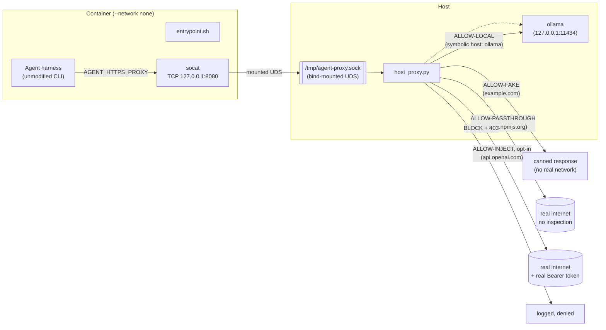

# agents.net the Hard Way

Bootstrap a Zero-Network Sandbox from scratch, one command at a time.

This tutorial walks through the [agents.net](../README.md) reference implementation end to end. By the end you will have run a real, unmodified, off-the-shelf agent CLI inside a container with **`--network none`**, and watched it reach the outside world through nothing but an `HTTP CONNECT` proxy and a mounted CA certificate.

Read the [agents.net specification](../README.md) first for the *why* (the Proxy Contract and the Trust Contract). This doc is the *how*.

Everything here runs against a free, local model server ([Ollama](https://ollama.com)) by default, so you can work through the whole tutorial without a paid API key or a dependency on any single model provider. A final section shows how to point the exact same image at a real hosted provider instead, using the same credential-injection contract rather than a key baked into the image.

## Target Audience

This tutorial is for engineers building or evaluating sandboxes for autonomous agents, who want to see the "ACLs + Proxies, not a routed network" architecture actually run, rather than just read about it.

## What You'll Build



Four allow-list tiers, enforced entirely on the host side, with the container never holding a routable network interface or a real secret.


## Prerequisites

- Docker
- `openssl`, `sh`/`bash`, `python3` (no third-party Python packages required -- `host_proxy.py` only uses the standard library)
- [Ollama](https://ollama.com) running as a normal (non-sandboxed) container on the host, published to loopback only -- see Lab 1. No paid API key, no account, no vendor lock-in.

All commands below are run from the repository root unless noted otherwise.

## Lab 1: Start the Local Model Provider (Ollama)

The agent harness needs a model to talk to. Run Ollama as an ordinary Docker container -- it is **not** part of the sandbox and has completely normal networking; only the host proxy will ever talk to it on the sandbox's behalf:

```bash
docker run -d --name ollama \
  -p 127.0.0.1:11434:11434 \
  -v ollama_data:/root/.ollama \
  ollama/ollama:latest

docker exec ollama ollama pull qwen3-coder:latest
```

`-p 127.0.0.1:11434:11434` publishes Ollama to the host's loopback interface only -- not to the LAN, and not on a Docker network shared with the sandbox. The sandboxed container will never be able to reach it directly (it has no network interface at all); only `host_proxy.py`, running with normal host networking, dials `127.0.0.1:11434` on the sandbox's behalf. This is the same "the proxy holds the thing the sandbox isn't trusted with" pattern as `CREDENTIAL_HOSTS`, just with a real address instead of a real secret.

`qwen3-coder:latest` is a reasonably capable coding model; swap in a smaller one (e.g. a `*-coder` model with fewer parameters) if your machine is resource-constrained -- just update the model name in [opencode.json](opencode.json) and [Dockerfile](Dockerfile) to match.

**Verify:**

```bash
curl -s http://127.0.0.1:11434/api/tags | grep qwen3-coder
```

## Lab 2: Generate the Demo Certificate Authority

The host proxy terminates TLS locally for its fake-response tier, so it needs its own root CA and a leaf certificate. [gen_certs.sh](gen_certs.sh) generates both:

```bash
./demo/gen_certs.sh
```

This creates:

- `demo/certs/agent-ca.pem` / `agent-ca.key` — the demo root CA. `agent-ca.pem` is what gets mounted into the sandbox as `AGENT_CA_CERT` to fulfill the Trust Contract.
- `demo/certs/agent-mitm.pem` / `agent-mitm.key` — a single leaf certificate with a `SAN` entry per host the proxy needs to terminate TLS for (`example.com` by default).

A single cert with multiple exact `SAN` entries is used instead of a wildcard: `*.example.com` matches one subdomain label and never the bare apex `example.com` itself. Since this is a private demo CA (not bound by public CA/Browser-Forum wildcard rules), listing exact hostnames is simpler and fully general -- pass extra hostnames as arguments to cover more, e.g. `./demo/gen_certs.sh api.openai.com` (needed later, only for the cloud-migration bonus). The local-provider tier (Ollama) needs no `SAN` entry at all -- it's a plain, un-terminated HTTP relay.

**Verify:**

```bash
openssl x509 -in demo/certs/agent-mitm.pem -noout -text | grep -A1 "Subject Alternative Name"
```

Expected output includes `DNS:example.com`.

## Lab 3: Understand and Start the Host Proxy

[host_proxy.py](host_proxy.py) is the entire enforcement point. It binds a Unix Domain Socket, speaks `HTTP CONNECT`, and enforces a four-tier allow-list:

| Tier | Example hosts | What happens | Configured via |
|---|---|---|---|
| **Fake-response** | `example.com` | Never forwarded. TLS terminated locally with the demo CA; a canned success body is returned. | `FAKE_RESPONSE_HOSTS` (hardcoded to the demo's task target) |
| **Local-provider** | `ollama` (symbolic) | No TLS termination, no credential. A plain byte relay from the sandbox's symbolic hostname to a real `host:port` on the operator's own machine -- the sandbox can never resolve or route to it on its own. | `AGENT_PROXY_LOCAL_PROVIDERS="symbolic=host:port,..."` (default `ollama=127.0.0.1:11434`) |
| **Passthrough** | `registry.npmjs.org` | No TLS termination, no injection -- a plain byte-for-byte relay straight to the real host. Used for a harness's own housekeeping (package installs, update checks, telemetry) that carries no secret. | `AGENT_PROXY_PASSTHROUGH="host,host,..."` (default `registry.npmjs.org`) |
| **Credential-inject**, opt-in | `api.openai.com` | TLS terminated locally, the agent's `Authorization` header (empty, placeholder, or garbage) is stripped and replaced with the real `Bearer <token>`, then genuinely relayed upstream with the real system trust store. Empty/unconfigured by default -- see the cloud-migration section at the end of this tutorial. | `AGENT_PROXY_TOKENS="host=ENV_VAR_NAME,..."` |

Anything not on any of the four lists is **blocked** and logged, and the agent is sent a normal HTTP `403` explaining why -- in-band signaling instead of a silent hang.

Start the proxy on the host. For the local-only demo in this tutorial, no credentials are needed at all:

```bash
python3 demo/host_proxy.py
```

**Verify** -- the startup banner should show all four allow-lists:

```
[*] Host Proxy listening on: /tmp/agent-proxy.sock
[*] Fake-response allow-list: ['example.com']
[*] Local-provider allow-list: {'ollama': ('127.0.0.1', 11434)}
[*] Credential-inject allow-list: {}
[*] Passthrough allow-list: ['registry.npmjs.org']
[*] Audit log: /tmp/agent-proxy-audit.log
```

An empty `Credential-inject allow-list: {}` is expected and correct here -- that tier is opt-in, for the cloud-migration bonus later. Leave the proxy running in this terminal (or run it under `&`/a separate pane) for the rest of the tutorial.

## Lab 4: Inspect the Sandbox Bridge

[entrypoint.sh](entrypoint.sh) is what runs *inside* the container. It does three things, in order:

1. Bridges the mounted Unix Domain Socket back to a local TCP port with `socat`, since most HTTP clients don't speak CONNECT-over-UDS directly.
2. Exports the canonical `AGENT_HTTP_PROXY` / `AGENT_HTTPS_PROXY` / `AGENT_NO_PROXY` contract variables. It does **not** export the conventional `HTTP_PROXY`/`http_proxy` by default -- the agent has to discover the `AGENT_*` variables itself.
3. If `AGENT_NET_LEGACY_COMPAT=1`, additionally exports `HTTP_PROXY`/`HTTPS_PROXY`/`NO_PROXY` (and lowercase aliases), for tools that only honor the conventional names. If a CA is mounted at `/var/run/agent-ca.pem`, it also wires up `AGENT_CA_CERT`, `REQUESTS_CA_BUNDLE`, `NODE_EXTRA_CA_CERTS`, and `SSL_CERT_FILE`.

No changes are needed here for this tutorial -- just read it once so Lab 6's behavior isn't a surprise. Notably, [OpenCode](https://github.com/anomalyco/opencode) (the harness this demo uses) natively honors exactly these conventional variable names ([documented here](https://opencode.ai/docs/network)), so `AGENT_NET_LEGACY_COMPAT=1` is what makes it work without any code changes.

## Lab 5: Build the Sandbox Image

[Dockerfile](Dockerfile) installs the [OpenCode CLI](https://github.com/anomalyco/opencode) exactly as published (no forking, no patching), copies in the demo's [opencode.json](opencode.json) provider config, and wires `entrypoint.sh` as the container's `ENTRYPOINT`:

```bash
docker build -t agentsnet-demo demo/
```

**Verify:**

```bash
docker run --rm --network none agentsnet-demo opencode --version
```

This should print an OpenCode CLI version string, proving the harness runs and exits cleanly even before any proxying is involved (it takes no network to print its own version).

## Lab 6: Run the Agent With No Network Interface

Run the container with networking explicitly disabled, the demo CA mounted read-only, and the host proxy's socket bind-mounted in:

```bash
docker run --rm \
  --network none \
  -v /tmp/agent-proxy.sock:/var/run/agent-proxy.sock \
  -v "$(pwd)/demo/certs/agent-ca.pem:/var/run/agent-ca.pem:ro" \
  -e AGENT_NET_LEGACY_COMPAT=1 \
  agentsnet-demo
```

Notice there is no `-e` flag carrying any kind of API key. [opencode.json](opencode.json) already configures the `ollama` provider with `apiKey: "ollama"` -- a fixed, non-secret literal (Ollama's OpenAI-compatible API accepts any string as a bearer token), so there is nothing to inject and nothing to keep out of the image. This is strictly simpler than the credential-inject tier, and it's why the local-only path needs no placeholder-swap dance at all.

The container has no `eth0`, no routing table entry beyond loopback, and no DNS resolver configuration pointing anywhere real -- yet OpenCode will complete the task ("fetch `https://example.com` and report its status code") purely through the mounted socket and CA, reasoning with a model running entirely on your own machine.

## Lab 7: Read the Audit Trail

While (or after) Lab 6 runs, tail the audit log on the host:

```bash
tail -f /tmp/agent-proxy-audit.log
```

A representative run looks like this:

```
2026-07-25T09:10:44.960579+00:00 BLOCK CONNECT models.dev:443
2026-07-25T09:10:44.995812+00:00 ALLOW-PASSTHROUGH CONNECT registry.npmjs.org:443
2026-07-25T09:10:47.303977+00:00 ALLOW-PASSTHROUGH CONNECT registry.npmjs.org:443
2026-07-25T09:10:49.552104+00:00 ALLOW-LOCAL POST http://ollama:11434/v1/chat/completions
2026-07-25T09:10:51.883853+00:00 ALLOW-LOCAL POST http://ollama:11434/v1/chat/completions
2026-07-25T09:10:52.910212+00:00 ALLOW-FAKE CONNECT example.com:443
```

Reading it line by line:

- **`BLOCK CONNECT models.dev:443`** -- real, unprompted behavior from the unmodified CLI (a model-pricing/catalog lookup it does at startup), caught by the ACL exactly as the "ACLs + Proxies" architecture is meant to: *nobody explicitly asked it to reach this host.* It's harmless to leave blocked -- OpenCode falls back gracefully and the run continues. If you'd rather it succeed, add it to `AGENT_PROXY_PASSTHROUGH`.
- **`ALLOW-PASSTHROUGH CONNECT registry.npmjs.org:443`** -- OpenCode dynamically installs the AI SDK package for whichever provider you configure (here, `@ai-sdk/openai-compatible` for the `ollama` provider) the first time it's used, caching it locally afterward (see [OpenCode's troubleshooting docs](https://opencode.ai/docs/troubleshooting)). In practice it also reaches back out to the registry periodically over the course of a run, not just once -- expect to see this line recur, not just at startup.
- **`ALLOW-LOCAL POST http://ollama:11434/v1/chat/completions`** -- one line per request to the local model. The sandbox only ever sees the symbolic hostname `ollama`; the proxy alone maps it to `127.0.0.1:11434` on the host.
- **`ALLOW-FAKE CONNECT example.com:443`** -- the demo's task target, answered locally with a canned response, never touching the real internet.

Because the image's `CMD` is just a normal non-interactive invocation, the same image and bridge can be reused for a harder follow-up exercise later -- e.g. asking the agent to see what it can reach *beyond* the intended allow-list -- by overriding the `docker run` command with a different prompt, no rebuild required. The audit log will show every blocked attempt made along the way.

**A note on model choice:** the task itself (fetching one URL and reporting its status) is trivial, but it still requires a model competent enough to reliably follow OpenCode's tool-calling format. Very small models (in the sub-2B range) may stall, loop, or emit a tool call as plain text instead of actually invoking it -- that's a model-capability limit, not a sandbox or proxy problem; the audit log will still show every real request the model *did* manage to make. `qwen3-coder:latest` is sized to avoid this.

## Migrating to a Hosted/Cloud Provider (the agents.net Way)

Everything above runs for free, against a model on your own machine, with zero dependency on any particular vendor. Swapping in a real hosted provider later -- because you want a stronger model, for instance -- is a config change, not a rebuild, and it never requires baking a real secret into the image, an env var, or a mounted file.

1. **Add a provider block to `opencode.json`, with a placeholder key:**

   ```jsonc
   {
     "provider": {
       "ollama": { /* ... unchanged ... */ },
       "openai": {
         "npm": "@ai-sdk/openai",
         "name": "OpenAI",
         "options": {
           "apiKey": "sandbox-placeholder-not-a-real-key"
         },
         "models": {
           "gpt-5": {}
         }
       }
     }
   }
   ```

   The placeholder is never a real key -- exactly as with the local-provider tier's fixed `"ollama"` literal, the proxy strips and replaces whatever the sandbox sends before it ever reaches the real backend.

2. **Regenerate the demo cert to also cover `api.openai.com`:**

   ```bash
   ./demo/gen_certs.sh api.openai.com
   ```

3. **Start `host_proxy.py` with the real key only in the host's own shell:**

   ```bash
   export OPENAI_API_KEY="<your real key>"   # stays on the host, never in the container
   AGENT_PROXY_TOKENS="api.openai.com=OPENAI_API_KEY" python3 demo/host_proxy.py
   ```

4. **Run the exact same image, unchanged**, just pointing OpenCode at the new provider/model:

   ```bash
   docker run --rm \
     --network none \
     -v /tmp/agent-proxy.sock:/var/run/agent-proxy.sock \
     -v "$(pwd)/demo/certs/agent-ca.pem:/var/run/agent-ca.pem:ro" \
     -e AGENT_NET_LEGACY_COMPAT=1 \
     agentsnet-demo \
     opencode run --model openai/gpt-5 --auto "Fetch https://example.com and report its HTTP status code..."
   ```

Nothing about the sandbox, the `Dockerfile`, or the `docker run` invocation's networking changed -- only the harness's own provider config and the host proxy's credential-inject configuration did. This is the same principle as the local-provider tier, just with a real secret involved: the sandbox only ever knows a symbolic name (or a placeholder), never the thing that makes it real.

If you see `ERROR: Quota exceeded. Check your plan and billing details.` here, the proxy did its job -- the audit log will show `ALLOW-INJECT ... api.openai.com` with a real credential fingerprint, meaning the real request reached the real API with the real token. That error comes back from the provider itself and means the key has no available quota/billing -- unrelated to the sandbox or the proxy.

## Troubleshooting

**OpenCode reports it can't reach the `ollama` provider / connection refused**
Confirm Ollama is actually running and has the model pulled: `docker exec ollama ollama list` should show `qwen3-coder:latest`. Also confirm `host_proxy.py`'s startup banner shows a non-empty `Local-provider allow-list` -- if `AGENT_PROXY_LOCAL_PROVIDERS` was overridden without `ollama=...`, that host stops being allow-listed.

**`BLOCK CONNECT registry.npmjs.org:443`**
If `AGENT_PROXY_PASSTHROUGH` was overridden when starting the proxy, make sure `registry.npmjs.org` is still included, e.g. `AGENT_PROXY_PASSTHROUGH="registry.npmjs.org,some-other-host.example" python3 demo/host_proxy.py`.

**`BLOCK CONNECT models.dev:443`**
Expected and harmless -- OpenCode's own model-pricing/catalog lookup, which it does without being asked and degrades gracefully if blocked. Add it to `AGENT_PROXY_PASSTHROUGH` if you'd rather it succeed.

**`BLOCK CONNECT` lines for other hosts you didn't expect**
This is the ACL working as designed. Two options, both valid:
- Leave it blocked. This is the "unexpected-egress visibility" the architecture is meant to provide.
- Add the host to `AGENT_PROXY_PASSTHROUGH` (comma-separated) when starting `host_proxy.py`.

**`[!] no demo MITM cert (run gen_certs.sh) -- blocking`**
Lab 3 was started before Lab 2 completed. Run `./demo/gen_certs.sh` and restart `host_proxy.py`.

**`AGENT_PROXY_TOKENS: '<VAR>' is not set on the host -- '<host>' will NOT be reachable`**
Only relevant for the cloud-migration section above -- fails closed by design. Export the referenced environment variable in the *host's* shell (not the container's) before starting `host_proxy.py`.

**Container hangs with no output**
Confirm the UDS bind mount path matches where `host_proxy.py` is actually listening (`/tmp/agent-proxy.sock` by default) and that the proxy process is still running on the host.

## Automated Testing

Run unit tests and the end-to-end sandbox presubmit test locally:

```bash
./demo/test_demo.sh
```

This automated suite runs:
1. Python unit tests for `host_proxy.py` logic.
2. Certificate generation (`gen_certs.sh`).
3. Container build (`docker build`).
4. Harness version check in a `--network none` container.
5. Proxy execution and verification of `AGENT_HTTP_PROXY` + `AGENT_CA_CERT` TLS termination.
6. ACL blocking and HTTP 403 response verification.
7. Host proxy audit trail log verification.

This suite also runs automatically on GitHub Actions presubmit for all pull requests and pushes to `main`.

## Cleanup

```bash
# Stop the host proxy (Ctrl+C if run in the foreground, or):
pkill -f demo/host_proxy.py

rm -f /tmp/agent-proxy.sock /tmp/agent-proxy-audit.log
docker rm -f ollama
docker volume rm ollama_data
docker rmi agentsnet-demo
```

