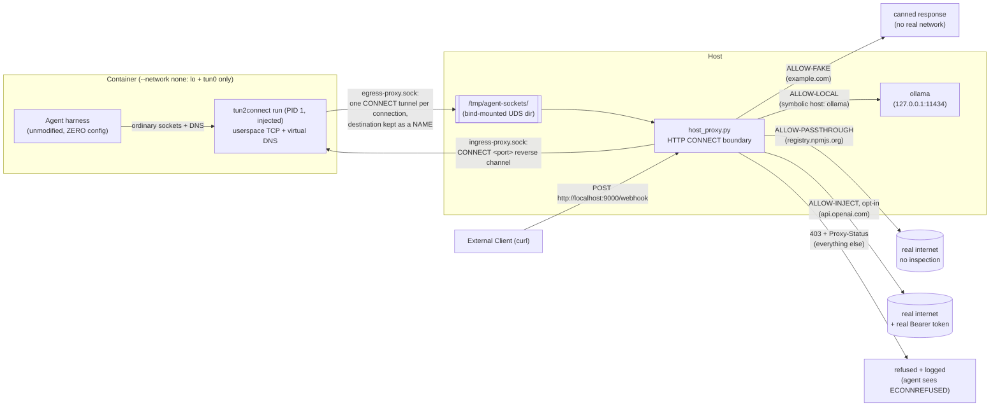

# agents.net the Hard Way

Build a zero-network sandbox from scratch, one command at a time.

This tutorial walks through the [agents.net](../README.md) reference implementation ([sdk/](../sdk/README.md)) end to end. You'll run an unmodified agent harness in a container started with **`--network none`**, confined by a launcher that is injected at `docker run` time. Every connection the harness opens crosses one Unix socket as a named HTTP `CONNECT` tunnel ([the spec's egress wire](../spec/draft/wire.md)), and the host checks it against policy and writes an audit line. A later section swaps the boundary for other CONNECT-terminating implementations, including an unmodified Envoy.

Read the [agents.net specification](../spec/draft/index.md) first; it covers the sandbox definition, the egress boundary interface, the TLS inspection models, the ingress interface, the security model, and the decision matrix. This tutorial assumes that background and concentrates on running the pieces.

By default everything runs against a local model server ([Ollama](https://ollama.com)), so you don't need a paid API key or an account with any model provider. A later section points the same image at a hosted provider through the boundary's credential-inject tier; the key stays on the host, and neither the image nor the run command changes.

## Target Audience

This tutorial is for engineers who build or evaluate sandboxes for autonomous agents and want to see the architecture run rather than only read about it. In this architecture the sandbox gets a route and a socket instead of a routed network.

## What You'll Build



The host boundary decides every flow by destination *name* against four allow-list tiers. The container never has a routable network interface, a path to a real DNS resolver, or a real secret, and the image knows nothing about agents.net: the launcher is injected at run time, which is the entrypoint injection the spec recommends.


## Prerequisites

- Docker
- `openssl`, `sh`/`bash`, `python3` (`host_proxy.py` uses only the standard library, so no third-party Python packages)
- Go, or Docker alone (Lab 3 shows both ways to build the launcher)
- [Ollama](https://ollama.com) running as an ordinary, unsandboxed container on the host, published to loopback only (Lab 1). No API key or account is needed.

Run all commands from the repository root unless noted otherwise.

## Lab 1: Start the Local Model Provider (Ollama)

The agent harness needs a model to talk to. Run Ollama as an ordinary Docker container with normal networking. It is **not** part of the sandbox; the host boundary is the only thing that will talk to it on the sandbox's behalf:

```bash
docker run -d --name ollama \
  -p 127.0.0.1:11434:11434 \
  -v ollama_data:/root/.ollama \
  ollama/ollama:latest

docker exec ollama ollama pull qwen2.5:0.5b
```

`-p 127.0.0.1:11434:11434` publishes Ollama on the host's loopback interface only, not on the LAN and not on a Docker network the sandbox could share. The sandboxed container has no network interface at all, so it can't reach Ollama directly; `host_proxy.py`, running with normal host networking, dials `127.0.0.1:11434` for it. This is the same arrangement as `CREDENTIAL_HOSTS` later on: the boundary holds something the sandbox isn't trusted with, in this case an address rather than a secret.

`qwen2.5:0.5b` (397 MB) is small and fast enough to run the demo on a laptop without much memory. You can pick a larger model in [agent.py](agent.py) and [Dockerfile](Dockerfile).

**Verify:**

```bash
curl -s http://127.0.0.1:11434/api/tags | grep qwen2.5
```

## Lab 2: Generate the Demo Certificate Authority

The host boundary terminates TLS locally for its fake-response tier, so it needs its own root CA and a leaf certificate. [gen_certs.sh](gen_certs.sh) generates both:

```bash
./demo/gen_certs.sh
```

This creates:

- `demo/certs/agent-ca.pem` / `agent-ca.key`: the demo root CA. The [Dockerfile](Dockerfile) bakes `agent-ca.pem` into the image's system trust store at build time (the trust-store coordination described in the spec's [TLS inspection models](../spec/draft/gateway.md#1-tls-inspection-and-verification-models)), so run this lab **before** Lab 5.
- `demo/certs/agent-mitm.pem` / `agent-mitm.key`: one leaf certificate with a `SAN` entry for each host the boundary terminates TLS for (`example.com` by default). The leaf stays on the host and never enters the image, so adding TLS-inspected hosts later needs no rebuild.

The script lists exact hostnames as `SAN` entries rather than using a wildcard, because `*.example.com` matches one subdomain label and not the bare apex `example.com`. A private demo CA isn't bound by the CA/Browser Forum's wildcard rules, so exact names are the simpler choice and cover any host you add. Pass extra hostnames as arguments, for example `./demo/gen_certs.sh api.openai.com`; you'll need that only for the cloud-migration bonus.

**Verify:**

```bash
openssl x509 -in demo/certs/agent-mitm.pem -noout -text | grep -A1 "Subject Alternative Name"
```

Expected output includes `DNS:example.com`.

## Lab 3: Build the Launcher

The launcher is this repo's [tun2connect](../sdk/) in its `run` mode, a static binary with no runtime dependencies. It becomes PID 1, terminates the sandbox's TCP in userspace with gVisor's netstack, answers DNS queries with invented addresses, and opens one named HTTP `CONNECT` tunnel per flow on the boundary socket. Build it once:

```bash
CGO_ENABLED=0 go -C sdk build -o "$PWD/demo/tun2connect" ./cmd/tun2connect
```

If there is no Go toolchain on the host, build it in a container instead:

```bash
docker run --rm -v "$PWD":/src -w /src/sdk -e CGO_ENABLED=0 \
  golang:1.26 go build -o /src/demo/tun2connect ./cmd/tun2connect
```

**Verify** that the binary is static (so it runs in any image, including scratch) and prints its usage:

```bash
file demo/tun2connect | grep "statically linked"
./demo/tun2connect run 2>&1 | head -2
```

## Lab 4: Understand and Start the Host Boundary

[host_proxy.py](host_proxy.py) is the demo's enforcement point, an HTTP CONNECT
proxy on a Unix domain socket. Each request names a hostname when the launcher
has a DNS mapping for the destination, and an IP address otherwise. The demo
policy sorts allowed hostnames into four tiers:

| Tier | Example hosts | What happens | Configured via |
| --- | --- | --- | --- |
| **Fake-response** | `example.com` | Never forwarded. TLS terminated locally with the demo CA; a canned success body is returned. | `FAKE_RESPONSE_HOSTS` (hardcoded to the demo's task target) |
| **Local-provider** | `ollama` (symbolic) | No TLS termination, no credential. A plain byte relay from the sandbox's symbolic hostname to a real `host:port` on the operator's own machine -- the sandbox can never resolve or route to it on its own. | `AGENT_PROXY_LOCAL_PROVIDERS="symbolic=host:port,..."` (default `ollama=127.0.0.1:11434`) |
| **Passthrough** | `registry.npmjs.org` | No TLS termination, no injection -- a plain byte-for-byte relay straight to the real host. Used for a harness's own housekeeping (package installs, update checks, telemetry) that carries no secret. | `AGENT_PROXY_PASSTHROUGH="host,host,..."` (default `registry.npmjs.org`) |
| **Credential-inject**, opt-in | `api.openai.com` | TLS terminated locally, the agent's `Authorization` header (empty, placeholder, or garbage) is stripped and replaced with the real `Bearer <token>`, then genuinely relayed upstream with the real system trust store. Empty/unconfigured by default -- see the cloud-migration section at the end of this tutorial. | `AGENT_PROXY_TOKENS="host=ENV_VAR_NAME,..."` |

Anything not on the four lists is refused with `403 Forbidden` and a
`Proxy-Status` field that carries the reason, and the refusal is logged. Inside
the sandbox the agent sees a failed connection. The demo policy also refuses IP
literals, but that is a choice of this sample policy rather than a limit of the
protocol or the launcher: the [Go boundary](../sdk/cmd/connect-proxy/main.go)
accepts addresses and CIDRs through `ip` and `cidr` rules in its
[policy descriptor](../spec/draft/policy.md). Unlike this demo, it also
resolves allowed hostnames itself and refuses results that aren't public
addresses.

Start the boundary on the host. The local-only demo needs no credentials:

```bash
python3 demo/host_proxy.py
```

**Verify** that the startup banner shows all four allow-lists:

```text
[*] Host Boundary (HTTP CONNECT) listening on: /tmp/agent-sockets/egress-proxy.sock
[*] Fake-response allow-list: ['example.com', 'httpbin.org']
[*] Local-provider allow-list: {'ollama': ('127.0.0.1', 11434)}
[*] Credential-inject allow-list: {}
[*] Passthrough allow-list: ['models.dev', 'registry.npmjs.org']
[*] Audit log: /tmp/agent-proxy-audit.log
```

`Credential-inject allow-list: {}` is expected: that tier is opt-in and only used in the cloud-migration bonus. Leave the boundary running in this terminal, or in the background with `&` or a separate pane, for the rest of the tutorial.

## Lab 5: Build the Sandbox Image

The [Dockerfile](Dockerfile) installs the harness dependencies, copies in the demo's [agent.py](agent.py), and bakes the demo CA into the system trust store. It contains **no launcher, no proxy variables, no bridge scripts, and no socket paths**; the image knows nothing about agents.net:

```bash
docker build -t agentsnet-demo demo/
```

**Verify** by running the image *without* the launcher; the zero-network sandbox fails closed:

```bash
docker run --rm --network none agentsnet-demo
```

Every connection attempt fails at once, because the container has no `eth0`, no route, and no resolver. The isolation comes from the runtime rather than from a firewall rule. The launcher starts from this state and adds the only way out.

## Lab 6: Run the Agent Behind the Injected Launcher

Now run the agent behind the launcher. This is the **entrypoint injection** the spec recommends: the launcher binary is bind-mounted read-only, `--entrypoint` puts it in front of the image's command, and three flags supply what the [egress boundary interface](../spec/draft/wire.md#1-egress-boundary-interface) needs, namely no network, a tun device, and the socket directory:

```bash
docker run --rm \
  --network none \
  --cap-add NET_ADMIN --device /dev/net/tun \
  -v /tmp/agent-sockets:/var/run/agents.net \
  -v "$(pwd)/demo/tun2connect:/tun2connect:ro" \
  --entrypoint /tun2connect \
  agentsnet-demo \
  run /var/run/agents.net/egress-proxy.sock \
  python3 /demo/agent.py "Fetch https://example.com and report its status code."
```

The command passes no `-e` flag with an API key, **no proxy environment variables, and no compatibility switches**. The harness runs exactly as it would on a normal network, with ordinary sockets, DNS, and HTTP, and is confined anyway. `tun2connect run` becomes PID 1, refuses to start if any interface other than loopback and its own tun exists, configures `tun0` as the only route, and delivers every flow to `host_proxy.py` as a named HTTP `CONNECT` tunnel.

The agent resolves and calls `ollama`, a name that exists only in the boundary's configuration. It completes its task against `example.com`, which the boundary answers locally with the canned response over TLS that the container trusts because of the baked-in demo CA. Any other destination it tries is refused with a plain connection error.

## Lab 7: Read the Audit Trail

While Lab 6 runs, or after it finishes, tail the audit log on the host:

```bash
tail -f /tmp/agent-proxy-audit.log
```

A representative run looks like this:

```text
2026-08-25T14:20:12.301442+00:00 ALLOW-LOCAL ollama:11434
2026-08-25T14:20:14.887210+00:00 ALLOW-FAKE example.com:443
2026-08-25T14:20:15.104332+00:00 BLOCK secret-vault.example:443
```

Reading it line by line:

- **`ALLOW-LOCAL ollama:11434`**: the harness's model call, relayed to your Ollama container. The name `ollama` arrived intact through the launcher's virtual DNS, and only the boundary knows the real address.
- **`ALLOW-FAKE example.com:443`**: the demo's task target. The boundary terminated TLS locally and answered with a canned response; nothing went to the real internet.
- **`BLOCK secret-vault.example:443`**: a destination on none of the lists. The boundary refused it with `403` and a `Proxy-Status` reason, the agent saw a connection error, and the attempt was recorded here. Each flow gets one decision and one log line.

The launched command is an ordinary non-interactive invocation, so you can reuse the image with a different prompt by changing the trailing arguments; no rebuild is needed.

## Lab 8 (Optional): Ingress -- Deliver a Webhook Into the Sandbox

Ingress uses a second Unix socket, which the launcher serves from *inside* the sandbox. `--ingress-port` pins the loopback ports (one or more, comma-separated) that ingress streams may reach. When `--ingress-socket` is given without it, the launcher refuses to start, and a `CONNECT` that names any other port is answered `403` with `Proxy-Status: ingress; error=http_request_denied; reason=port-not-permitted`. Both flags must come **before** the boundary-socket argument, because the launcher stops parsing flags at the first positional argument and passes everything after it to the agent untouched:

```bash
docker run --rm \
  --network none \
  --cap-add NET_ADMIN --device /dev/net/tun \
  -v /tmp/agent-sockets:/var/run/agents.net \
  -v "$(pwd)/demo/tun2connect:/tun2connect:ro" \
  --entrypoint /tun2connect \
  agentsnet-demo \
  run --ingress-socket /var/run/agents.net/ingress-proxy.sock --ingress-port 8081 \
  /var/run/agents.net/egress-proxy.sock \
  python3 /demo/agent.py "Fetch https://example.com and report its status code."
```

From another terminal, deliver a webhook through the boundary's public ingress gateway (port `9000`):

```bash
curl -s -X POST -d 'deploy finished' http://localhost:9000/webhook
```

The boundary dials the sandbox's ingress socket and performs the [ingress handshake](../spec/draft/ingress.md#2-wire): it sends `CONNECT 127.0.0.1:8081 HTTP/1.1`, and the launcher answers `200` and joins the stream to the agent's loopback listener. (A microVM offers the same channel over vsock.) The agent prints the delivered payload, and the audit log gains an `INGRESS` line.

*Permissions note:* the launcher creates the ingress socket file from inside the container and sets its mode to `0666` so that the unprivileged `host_proxy.py` can dial it. If you swap in a launcher that doesn't, open it yourself: `docker exec <container> chmod 666 /var/run/agents.net/ingress-proxy.sock`. Under rootless Podman the question doesn't arise, because container root is your own uid and the socket is created owned by you.

## Bonus: Migrate to a Real Cloud Model -- Without Touching the Sandbox

Everything above ran against the local provider. To switch the same sandbox to a hosted backend such as `api.openai.com`, use the credential-inject tier. The image, the `docker run` command, and the agent stay the same; only host-side state changes.

```bash
# 1. Add the host to the leaf cert (host-side file only; no image rebuild):
./demo/gen_certs.sh api.openai.com

# 2. Hand the boundary the real key, by env var NAME, and restart it:
export OPENAI_API_KEY=sk-...           # exists only in the HOST's shell
AGENT_PROXY_TOKENS="api.openai.com=OPENAI_API_KEY" python3 demo/host_proxy.py
```

The startup banner now lists the host with a non-secret fingerprint (`sha256:...`), and `ALLOW-INJECT` audit lines carry the same fingerprint, so you can confirm that a key rotation took effect without the log ever holding a secret. The sandboxed agent may send an empty, placeholder, or garbage `Authorization` header; the boundary strips it and injects the real one. The real credential never enters the sandbox, and the only process that holds it is the boundary.

## Implementation Examples

The [specification](../spec/draft/wire.md) uses HTTP CONNECT between the
guest adapter and the boundary. The examples below put different
implementations of that interface at the boundary. Each deployment still has
to supply its own channel access controls, workload identity, and destination
policy.

### Lab A: the reference boundary, no root required

`connect-proxy` is the Go counterpart of `host_proxy.py`. It reads a [policy descriptor](../spec/draft/policy.md), denies by default on names, addresses, ports, and transports, and writes one JSON audit record per decision. curl speaks CONNECT to HTTP proxies, so you can watch the policy work without a sandbox:

```bash
go -C sdk build -o /tmp/connect-proxy ./cmd/connect-proxy
cat > /tmp/lab-a.json <<'EOF'
{"agents_net_policy": 1, "version": "lab-a-1", "sandbox": "lab-a", "default": "deny",
 "rules": [{"id": "example", "name": "example.com", "ports": [443]}]}
EOF
/tmp/connect-proxy -listen tcp://127.0.0.1:18080 -policy /tmp/lab-a.json &

curl --proxy http://127.0.0.1:18080 https://example.com -o /dev/null -w '%{http_code}\n'   # 200
curl --proxy http://127.0.0.1:18080 https://evil.example                                    # CONNECT tunnel failed, response 403
curl --proxy http://127.0.0.1:18080 http://example.com:8080/                                # 403: port-not-allowed
```

The audit records correspond to Lab 7's decisions and are made on the same input, the name and port in the CONNECT authority. The boundary resolves the allowed name itself, records the address it checked and dialed, and denies names that resolve to loopback, private, or link-local addresses unless the descriptor lists them in `resolved_addresses` or as literals. Each record carries the sandbox label and policy version from the descriptor the controller installed, and nothing the guest sent:

```json
{"ts":"2026-09-16T16:20:31Z","listener":"tcp://127.0.0.1:18080","sandbox":"lab-a","policy":"lab-a-1","wire":"h1","transport":"tcp","destination":"example.com:443","address":"93.184.216.34:443","rule":"example","decision":"allow"}
{"ts":"2026-09-16T16:20:33Z","listener":"tcp://127.0.0.1:18080","sandbox":"lab-a","policy":"lab-a-1","wire":"h1","transport":"tcp","destination":"evil.example:443","decision":"block","reason":"not-on-allowlist"}
{"ts":"2026-09-16T16:20:35Z","listener":"tcp://127.0.0.1:18080","sandbox":"lab-a","policy":"lab-a-1","wire":"h1","transport":"tcp","destination":"example.com:8080","decision":"block","reason":"port-not-allowed"}
```

`-h2` enables HTTP/2 CONNECT streams. `"features": {"udp": true}` in the
descriptor enables UDP proxying with `connect-udp` (RFC 9298).
`-max-connections`, `-max-streams`, and `-idle-timeout` cap the resources
one sandbox can hold.

### Lab B: Envoy CONNECT Example

The [example configuration](../sdk/examples/envoy-boundary.yaml) enables
HTTP/1.1 and HTTP/2 TCP CONNECT in Envoy. It listens on loopback and has no
workload authorization policy, so treat it as a transport interoperability
check rather than a production boundary configuration.

```bash
docker run -d --name envoy-connect --network host \
  envoyproxy/envoy:v1.32-latest \
  --config-yaml "$(cat sdk/examples/envoy-boundary.yaml)"

# h1 CONNECT through Envoy (an https:// target makes curl use CONNECT):
curl --proxy http://127.0.0.1:10000 https://example.com -o /dev/null -w '%{http_code}\n'   # 200
# Envoy's own view of the tunnels it terminated:
curl -s 127.0.0.1:19901/stats | grep downstream_cx_upgrades_total
```

Port `10001` accepts HTTP/2 CONNECT with prior knowledge. The
[interop test](../sdk/test_envoy.sh) exercises both listeners with the
repository's clients. It doesn't cover UDP, IPC transports, workload identity,
or gateway controllers that configure Envoy.

### Lab C: Workload Certificates

The boundary channel can run over mTLS.
`connect-proxy -h2 -tls-cert ... -tls-key ... -tls-client-ca ca.pem` requires a
verified client certificate and records its identity in the audit record. A
[SPIFFE](https://spiffe.io) URI is one form that identity can take:

```json
{"ts":"...","listener":"tcp://127.0.0.1:18443","wire":"h2","transport":"tcp","destination":"api.example.com:443","address":"203.0.113.10:443","peer":"spiffe://cluster.local/ns/sandbox/sa/agent-123","decision":"allow"}
```

Other certificate identities work too; the tests use
`sandbox://tenant-a/agent-123`. The reference proxy records the identity but
still authorizes against one global destination allowlist; identity-based
authorization is separate work. Running HTTP/2 over mTLS doesn't by itself
show interoperability with a service mesh.

## Troubleshooting

**The agent gets `Connection refused` for hosts you didn't expect**
The allow-list is doing its job. Check the audit log for the matching `BLOCK` line, then either:

- leave the host refused, which is how the architecture makes unexpected egress visible, or
- add it to `AGENT_PROXY_PASSTHROUGH` (comma-separated) when starting `host_proxy.py`.

**`tun2connect` exits immediately complaining about an unexpected interface**
The container wasn't started with `--network none`. The launcher refuses to run in a namespace that has any interface besides loopback and its own tun, so a half-configured sandbox fails at startup instead of leaving a second route open.

**`tun2connect` fails to create the tun**
The `docker run` line is missing `--cap-add NET_ADMIN`, `--device /dev/net/tun`, or both.

**`dropping CAP_NET_ADMIN after TUN setup: ...`**
Once the tun exists, the launcher removes `CAP_NET_ADMIN` from itself and from the agent's bounding set, and refuses to start the agent if that fails. Dropping the capability needs `CAP_SETPCAP` (part of the default container set; don't `--cap-drop SETPCAP`) and a launcher built with `CGO_ENABLED=0`, as in Lab 1.

**`[!] no demo MITM cert (run gen_certs.sh) -- refusing`**
The boundary (Lab 4) was started before the certificates (Lab 2) existed. Run `./demo/gen_certs.sh` and restart `host_proxy.py`.

**`AGENT_PROXY_TOKENS: '<VAR>' is not set on the host -- '<host>' will NOT be reachable`**
This only comes up in the cloud-migration bonus, and it fails closed on purpose. Export the named environment variable in the *host's* shell (not the container's) before starting `host_proxy.py`.

**Container hangs or every flow fails instantly**
Check that the socket directory you mounted is the one `host_proxy.py` is listening in (`/tmp/agent-sockets` on the host by default) and that the boundary process is still running.

**`[INGRESS ERROR] ... ERR the agent is not listening`**
The agent's loopback listener isn't up, or it listens on a different port from the boundary's `AGENT_INGRESS_PORT` (default `8081`).

## Automated Testing

Run the unit tests and the end-to-end sandbox presubmit locally:

```bash
./demo/test_demo.sh
```

The script runs, in order:

1. Python unit tests for `host_proxy.py` (CONNECT codec, dispatch, tier behavior, refusals).
2. Certificate generation (`gen_certs.sh`).
3. Launcher build (`tun2connect`) and container build.
4. A fail-closed check: the image with no launcher and no network makes zero connections.
5. The launcher-injected run: fake-response over TLS, local-provider relay, and a refused host observed as `ECONNREFUSED`.
6. Host boundary audit trail verification.

The same suite runs on GitHub Actions presubmit for all pull requests and pushes to `main`.

## Cleanup

```bash
# Stop the host boundary (Ctrl+C if run in the foreground, or):
pkill -f demo/host_proxy.py

rm -rf /tmp/agent-sockets /tmp/agent-proxy-audit.log
docker rm -f ollama
docker volume rm ollama_data
docker rmi agentsnet-demo
rm -f demo/tun2connect
```
