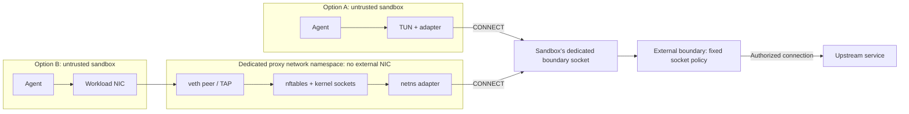

# agents.net Specification

**Version:** 1 (draft)  
**Status:** Draft. This directory is the working version; see
[../README.md](../README.md) for how versions are released.

`agents.net` defines a network interface between a sandbox and an external
policy-enforcing proxy. Applications inside the sandbox use ordinary sockets.
An adapter converts supported connections into HTTP `CONNECT` requests and
delivers them through a dedicated boundary socket. The adapter can run inside
the sandbox, in a dedicated network namespace, or in an isolated VMM packet
backend. The boundary applies the policy assigned to that socket before it
opens an upstream connection. The sandbox has no direct external network
path.

As long as runtime confinement remains intact, an application cannot bypass
the policy by ignoring proxy settings or replacing the adapter. Every adapter
and proxy uses the same HTTP interface, so the specification does not depend
on a particular proxy, service mesh, or orchestration system. An optional
application gateway can attach service credentials without giving the
reusable key to the workload.

TCP connections can target hostnames, IPv4 addresses, or IPv6 addresses, and
the boundary applies policy to each destination. UDP tunneling and ingress
are optional.

The key words "MUST", "MUST NOT", "REQUIRED", "SHALL", "SHALL NOT", "SHOULD",
"SHOULD NOT", "RECOMMENDED", "NOT RECOMMENDED", "MAY", and "OPTIONAL" in these
documents are to be interpreted as described in BCP 14 (RFC 2119, RFC 8174).

## Documents

| Document | Contents | Normative |
| --- | --- | --- |
| [wire.md](wire.md) | Egress wire: CONNECT request forms, parsing, success and failure responses, address policy, name matching, HTTP/2, UDP, tunnel content | Yes |
| [policy.md](policy.md) | Policy descriptor: the JSON document a controller installs and a customer moves between deployments | Yes |
| [audit.md](audit.md) | Audit record: one JSON object per decision | Yes |
| [identity.md](identity.md) | How a request is bound to a sandbox: dedicated listener, certificate, shared process with dedicated listeners, VM channels | Yes |
| [isolation.md](isolation.md) | Local security model, socket ownership, threat model, what can be established, software integrity, controller conformance, limits | Yes |
| [lifecycle.md](lifecycle.md) | Lifecycle, revocation, policy replacement, snapshot and restore, resource limits | Yes |
| [adapters.md](adapters.md) | Adapter profiles: packet, explicit, UDP, diagnostics; compatibility statement | Yes |
| [ingress.md](ingress.md) | Optional inbound channel: HTTP CONNECT to the pinned loopback port | Yes |
| [gateway.md](gateway.md) | Optional application gateways: TLS inspection models, credential placement | Yes, when used |
| [registries.md](registries.md) | Roles and profiles, reason tokens, registries, implementation statement | Yes |
| [schema/](schema/) | JSON Schema for the policy descriptor and audit record | Yes |

The following material is informative and is not part of the specification:
[rationale and alternatives](../../docs/rationale.md), [implementations and
their status](../../docs/implementations.md), [test
evidence](../../docs/evidence.md), the [conformance
suite](../../conformance/README.md), and the [reference
implementation](../../sdk/README.md).

## 1. Components

This specification uses the following terms:

- **Sandbox:** An isolated, untrusted workload with no direct external network access. Its only network path is one of the adapter placements below.
- **Adapter:** The component that translates application traffic into CONNECT requests. It can run inside the sandbox behind a TUN interface, outside the sandbox where the workload NIC terminates (a dedicated network namespace or an isolated userspace packet backend), or as an explicit endpoint for proxy-aware clients ([adapters.md](adapters.md)). The adapter has no authority to grant access.
- **Boundary socket:** A dedicated, access-controlled endpoint assigned to one sandbox lifetime and one policy. In the local model it is a pathname Unix stream socket.
- **Boundary proxy:** The external proxy that authorizes requests and opens upstream connections.
- **Controller:** The trusted runtime or launcher that creates the sandbox, sets up the adapter environment and socket access, and binds the policy. The controller is a role that an existing runtime can fill; a separate control-plane service is not needed.
- **Policy descriptor:** The JSON document that states what a sandbox may reach ([policy.md](policy.md)).
- **Generation:** One lifetime of a sandbox under one policy binding. A restart or a restore starts a new generation.

## 2. Network Path

For each supported connection, the adapter sends the destination hostname or
IP address and port to the boundary proxy. The proxy authorizes the request,
resolves the hostname when needed, and connects to an allowed address. A
denied request fails at the tunnel handshake. The following diagram shows the
TUN and namespace adapter paths. The adapter can also be placed in an
isolated userspace VMM packet backend or exposed as an explicit loopback
endpoint; every placement uses the same boundary interface and is subject to
the same destination policy requirements.

The two options in the diagram are alternative placements for a single
sandbox. Both reach that sandbox's own boundary socket; unrelated sandboxes
do not share an endpoint. In option A, the sandbox has no external NIC. In
option B, its only NIC terminates in the proxy namespace, which has no bridge
or route to an external network. In either option, changing routes inside the
guest does not open another exit.

When option A runs in a VM, the guest cannot reach a host Unix socket
directly, so the runtime must provide a restricted channel, such as a
dedicated vsock service bound to that VM's boundary socket. An unrestricted
host vsock listener is not a substitute. Provisioning this channel is a
deployment extension; the local container and namespace model does not need
it.

Firecracker's virtio-vsock device provides such a channel without a relay
process. A guest connection to CID 2 port `P` is delivered to the host Unix
socket `<uds_path>_P`, so the boundary listens directly on that path, and the
guest can reach only the ports the controller chose to bind under that VM's
prefix. Host-initiated connections to the guest go through `<uds_path>` with
Firecracker's own `CONNECT <port>` handshake. A VMM that exposes host
`AF_VSOCK` instead requires the CID mapping and per-VM listener discipline of
[identity.md Section 6](identity.md#6-vm-channels-controller-vm).

## 3. Roles

The specification defines four roles: **boundary**, **adapter**,
**controller**, and **ingress gateway**. Different parties can implement
them, and one implementation can combine several. Each role has conformance
profiles ([registries.md Section 1](registries.md#1-roles-and-profiles)) that
the [conformance suite](../../conformance/README.md) verifies.

## 4. Normative References

- [RFC 9110 Section 9.3.6](https://www.rfc-editor.org/rfc/rfc9110.html#section-9.3.6): CONNECT semantics.
- [RFC 9112](https://www.rfc-editor.org/rfc/rfc9112.html): HTTP/1.1 message syntax.
- [RFC 9113 Section 8.5](https://www.rfc-editor.org/rfc/rfc9113.html#section-8.5): CONNECT over HTTP/2.
- [RFC 9209](https://www.rfc-editor.org/rfc/rfc9209.html): the Proxy-Status HTTP response header field.
- [RFC 8441](https://www.rfc-editor.org/rfc/rfc8441.html): extended CONNECT over HTTP/2.
- [RFC 9297](https://www.rfc-editor.org/rfc/rfc9297.html): HTTP Datagrams and capsule framing.
- [RFC 9298](https://www.rfc-editor.org/rfc/rfc9298.html): UDP proxying over HTTP.
- [RFC 8446](https://www.rfc-editor.org/rfc/rfc8446.html): TLS 1.3 authentication and record protection.
- [RFC 9325](https://www.rfc-editor.org/rfc/rfc9325.html): recommendations for secure TLS use.
- [RFC 9525](https://www.rfc-editor.org/rfc/rfc9525.html): service identity verification with TLS.
- [RFC 5890](https://www.rfc-editor.org/rfc/rfc5890.html), [UTS #46](https://www.unicode.org/reports/tr46/): internationalized domain names.
- [RFC 6890](https://www.rfc-editor.org/rfc/rfc6890.html): special-purpose IP address registries.
