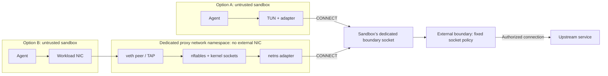

# agents.net Specification

**Version:** 1 (draft)  
**Status:** Draft. This directory is the working version; see
[../README.md](../README.md) for how versions are released.

`agents.net` defines a network interface between a sandbox and an external
policy-enforcing proxy. Applications use ordinary sockets. An adapter, either
inside the sandbox, in a dedicated network namespace, or in an isolated VMM
packet backend, converts supported connections into HTTP `CONNECT` requests.
Adapters deliver requests through a dedicated boundary socket. The boundary
applies that socket's assigned policy before opening an upstream connection.
The sandbox has no direct external network path.

Applications cannot bypass this policy by ignoring proxy settings or replacing
the adapter, provided runtime confinement remains intact. Runtime adapters and
proxies use the same HTTP interface; no particular proxy, service mesh, or
orchestration system is required. An optional application gateway can attach
service credentials without giving the reusable key to the workload.

TCP connections can target hostnames, IPv4 addresses, or IPv6 addresses. The
boundary applies policy to each destination. UDP tunneling and ingress are
optional.

The key words "MUST", "MUST NOT", "REQUIRED", "SHALL", "SHALL NOT", "SHOULD",
"SHOULD NOT", "RECOMMENDED", "NOT RECOMMENDED", "MAY", and "OPTIONAL" in these
documents are to be interpreted as described in BCP 14 (RFC 2119, RFC 8174).

## Documents

| Document | Contents | Normative |
| --- | --- | --- |
| [wire.md](wire.md) | Egress wire: CONNECT request forms, parsing, success and failure responses, address policy, name matching, HTTP/2, UDP, tunnel content | Yes |
| [policy.md](policy.md) | Policy descriptor: the JSON document a controller installs and a customer moves between deployments | Yes |
| [audit.md](audit.md) | Audit record: one JSON object per decision | Yes |
| [identity.md](identity.md) | How a request is bound to a sandbox: dedicated listener, certificate, shared process with dedicated listeners, VM channels | Yes |
| [isolation.md](isolation.md) | Local security model, socket ownership, threat model, what can be established, software integrity, controller conformance, limits | Yes |
| [lifecycle.md](lifecycle.md) | Lifecycle, revocation, policy replacement, snapshot and restore, resource limits | Yes |
| [adapters.md](adapters.md) | Adapter profiles: packet, explicit, UDP, diagnostics; compatibility statement | Yes |
| [ingress.md](ingress.md) | Optional inbound channel: HTTP CONNECT to the pinned loopback port | Yes |
| [gateway.md](gateway.md) | Optional application gateways: TLS inspection models, credential placement | Yes, when used |
| [registries.md](registries.md) | Roles and profiles, reason tokens, registries, implementation statement | Yes |
| [schema/](schema/) | JSON Schema for the policy descriptor and audit record | Yes |

Informative material is outside the specification: [rationale and
alternatives](../../docs/rationale.md), [implementations and their
status](../../docs/implementations.md), [test evidence](../../docs/evidence.md),
the [conformance suite](../../conformance/README.md), and the
[reference implementation](../../sdk/README.md).

## 1. Components

This specification uses the following terms:

- **Sandbox:** An isolated, untrusted workload with no direct external network access. Its only networking is through one of the adapter paths below.
- **Adapter:** The component that translates application traffic into CONNECT requests. It runs inside the sandbox with a TUN interface, or outside it terminating its NIC through a dedicated network namespace or isolated userspace packet backend, or exposes an explicit endpoint to proxy-aware clients ([adapters.md](adapters.md)). It has no authority to grant access.
- **Boundary socket:** A dedicated, access-controlled endpoint assigned to one sandbox lifetime and policy. In the local model it is a pathname Unix stream socket.
- **Boundary proxy:** The external proxy that authorizes requests and opens upstream connections.
- **Controller:** The trusted runtime or launcher that creates the sandbox, adapter environment, socket access, and policy binding. This is a responsibility, not a requirement for a separate control-plane service.
- **Policy descriptor:** The JSON document that states what a sandbox may reach ([policy.md](policy.md)).
- **Generation:** One lifetime of a sandbox under one policy binding; restarts and restores start a new generation.

## 2. Network Path

For each supported connection, the adapter sends the destination hostname or
IP address and port to the boundary proxy. The proxy authorizes the request,
resolves hostnames when needed, and connects to an allowed address. Denied
requests fail at the tunnel handshake. The following diagram shows the TUN and
namespace adapter paths. An isolated userspace VMM packet backend and an
explicit loopback endpoint are other placements; all use the same boundary
interface and destination-policy requirements.

The diagram shows alternatives for one sandbox, not a shared endpoint for
unrelated sandboxes. In option A, the sandbox has no external NIC. In option B,
its only NIC terminates in the proxy namespace, with no bridge or route to an
external network. Changing guest routes does not create another exit.

For a VM using option A, a Unix socket is not directly accessible across the
guest kernel. The runtime must provide a restricted channel, such as a dedicated
VSOCK service bound to that VM's boundary socket. An unrestricted host VSOCK
listener is not equivalent. VM channel provisioning is a deployment extension;
the local container and namespace model does not require it.

Firecracker's virtio-vsock device provides such a channel without a relay
process: guest connections to CID 2 port `P` are delivered to the host Unix
socket `<uds_path>_P`, so the boundary listens directly on that path and the
guest can reach only the ports the controller chose to bind under that VM's
prefix. Host-initiated connections to the guest go through `<uds_path>` with
Firecracker's own `CONNECT <port>` handshake. A VMM that exposes host
`AF_VSOCK` instead requires the CID mapping and per-VM listener discipline of
[identity.md Section 6](identity.md#6-vm-channels-controller-vm).

## 3. Roles

Four roles can be implemented by different parties and combined: **boundary**,
**adapter**, **controller**, and **ingress gateway**. Each has conformance
profiles ([registries.md Section 1](registries.md#1-roles-and-profiles))
verified by the [conformance suite](../../conformance/README.md).

## 4. Normative References

- [RFC 9110 Section 9.3.6](https://www.rfc-editor.org/rfc/rfc9110.html#section-9.3.6): CONNECT semantics.
- [RFC 9112](https://www.rfc-editor.org/rfc/rfc9112.html): HTTP/1.1 message syntax.
- [RFC 9113 Section 8.5](https://www.rfc-editor.org/rfc/rfc9113.html#section-8.5): CONNECT over HTTP/2.
- [RFC 9209](https://www.rfc-editor.org/rfc/rfc9209.html): the Proxy-Status HTTP response header field.
- [RFC 8441](https://www.rfc-editor.org/rfc/rfc8441.html): extended CONNECT over HTTP/2.
- [RFC 9297](https://www.rfc-editor.org/rfc/rfc9297.html): HTTP Datagrams and capsule framing.
- [RFC 9298](https://www.rfc-editor.org/rfc/rfc9298.html): UDP proxying over HTTP.
- [RFC 8446](https://www.rfc-editor.org/rfc/rfc8446.html): TLS 1.3 authentication and record protection.
- [RFC 9325](https://www.rfc-editor.org/rfc/rfc9325.html): recommendations for secure TLS use.
- [RFC 9525](https://www.rfc-editor.org/rfc/rfc9525.html): service identity verification with TLS.
- [RFC 5890](https://www.rfc-editor.org/rfc/rfc5890.html), [UTS #46](https://www.unicode.org/reports/tr46/): internationalized domain names.
- [RFC 6890](https://www.rfc-editor.org/rfc/rfc6890.html): special-purpose IP address registries.
