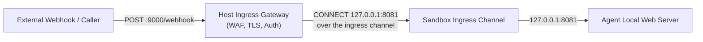

# Ingress

**Part of:** [agents.net specification, version 1 (draft)](index.md)  
**Status:** Draft

Ingress lets an isolated sandbox receive webhooks, OAuth callbacks, or prompts
without a per-sandbox external address or published port. It is optional and
separately authorized from egress ([lifecycle.md Section 2](lifecycle.md#2-ingress-revocation-and-updates)).

## 1. Arrangement



1. **Host Ingress Gateway:** A production gateway MUST authenticate requests, terminate public TLS, apply rate and payload limits, and authorize the external route to a specific workload and local service.
2. **Reverse Stream Channel:** An ingress stream channel (a Unix socket or vsock port) is provided inside the sandbox. When an external request arrives, the gateway connects to this channel and performs the handshake of Section 2.
3. **Loopback Forwarding:** The in-guest listener forwards the incoming stream to the agent's local web server listening on loopback (`127.0.0.1:$AGENT_INGRESS_PORT`). The listener joins streams only to the port the controller pinned when it started the adapter; the port named in the handshake must match it and does not select another service.
4. **Coordination Variables:** The agent learns its listening port and public callback URL from environment variables:

   ```bash
   AGENT_INGRESS_PORT=8081
   AGENT_PUBLIC_URL=https://agents.example.com/callbacks/agent-123
   ```

The trusted controller, not those guest variables alone, MUST authorize this
binding and revoke it during teardown.

## 2. Wire

The gateway connects to the sandbox's ingress channel and sends
`CONNECT 127.0.0.1:<port> HTTP/1.1` with a matching `Host` field. The adapter
answers 200 when `<port>` equals the pinned port and otherwise 403 with a
`Proxy-Status` field carrying `reason=port-not-permitted`
([wire.md Section 4](wire.md#4-failure-signaling)); it MUST NOT connect to any
other address or port. After 200 the stream is relayed verbatim to the pinned
port. A request whose first line is not an HTTP/1.1 CONNECT request line is
refused with 400 `malformed-request-line`. Parsing follows
[wire.md Section 2](wire.md#2-connect-parsing-and-authorization). A VMM's own
host-side handshake to reach a guest vsock port precedes and is distinct from
this exchange.

```http
CONNECT 127.0.0.1:8081 HTTP/1.1
Host: 127.0.0.1:8081

HTTP/1.1 200 OK

```

The gateway records every delivery it attempts as an audit record with
`direction: "ingress"` ([audit.md](audit.md)), including the adapter's
status and reason; the adapter runs inside the sandbox and its own logging
is not trusted evidence.

## 3. Gateway Obligations (`ingress-gateway`)

An ingress gateway authenticates the caller and maps an authorized service to
one sandbox generation and local address/port. Guest variables or
caller-selected ports do not grant that access. A route bound to a revoked
generation MUST NOT reach a replacement sandbox. A reverse-channel deployment
uses a separate connection with gateway/client and adapter/server roles; an
HTTP/2 server cannot initiate arbitrary reverse CONNECT requests on an
existing client session.
