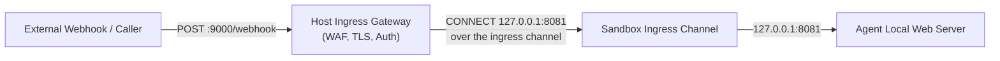

# Ingress

**Part of:** [agents.net specification, version 1 (draft)](index.md)  
**Status:** Draft

Ingress delivers inbound requests, such as webhooks, OAuth callbacks, or
prompts, to an isolated sandbox that has no external address or published
port of its own. Ingress is optional, and it is authorized separately from
egress ([lifecycle.md Section 2](lifecycle.md#2-ingress-revocation-and-updates)).

## 1. Arrangement



1. The host ingress gateway receives the external request. A production
   gateway MUST authenticate requests, terminate public TLS, apply rate and
   payload limits, and authorize the external route to a specific workload
   and local service.
2. An ingress channel (a Unix socket or a vsock port) is provided inside the
   sandbox. When an external request arrives, the gateway connects to this
   channel and performs the handshake of Section 2.
3. The in-guest listener relays the incoming stream to the agent's local
   server on loopback. It joins streams only to the ports the controller
   pinned when it started the adapter. The port named in the handshake must
   be one of those ports and cannot select another service. A controller MAY
   pin several ports for a sandbox that serves several local services.
4. The agent learns its listening port and public callback URL from
   environment variables that the controller sets:

   ```bash
   AGENT_INGRESS_PORT=8081
   AGENT_PUBLIC_URL=https://agents.example.com/callbacks/agent-123
   ```

   `AGENT_PUBLIC_URL` is the gateway's route for this sandbox generation. The
   agent uses it verbatim, for example as an OAuth redirect URI, and the
   gateway maps requests on that route to this sandbox's ingress channel.

The controller MUST authorize this binding and revoke it during teardown. The
guest variables alone do not authorize it.

## 2. Wire

The gateway connects to the sandbox's ingress channel and sends
`CONNECT 127.0.0.1:<port> HTTP/1.1` or `CONNECT [::1]:<port> HTTP/1.1` with
a matching `Host` field. When `<port>` is one of the ports the controller
pinned, the adapter answers 200 and then relays the stream verbatim to the
requested loopback address and port. Otherwise it answers 403 with a
`Proxy-Status` field carrying `reason=port-not-permitted`
([wire.md Section 4](wire.md#4-failure-signaling)). The adapter MUST NOT
connect to any other address or port. A request whose first line is not an
HTTP/1.1 CONNECT request line is refused with 400 `malformed-request-line`.
Parsing follows [wire.md Section 2](wire.md#2-connect-parsing-and-authorization).
When the channel is a vsock port, the VMM's own host-side handshake for
reaching the guest port takes place before this exchange and is not part of
it.

```http
CONNECT 127.0.0.1:8081 HTTP/1.1
Host: 127.0.0.1:8081

HTTP/1.1 200 OK

```

The gateway writes an audit record with `direction: "ingress"`
([audit.md](audit.md)) for every delivery it attempts, including the status
and reason the adapter returned. The adapter runs inside the sandbox, so its
own logs are not trusted evidence.

## 3. Gateway Obligations (`ingress-gateway`)

An ingress gateway authenticates the caller and maps an authorized service to
one sandbox generation and one local address and port. Neither guest
variables nor caller-selected ports grant that access. A route bound to a
revoked generation MUST NOT reach a replacement sandbox. A reverse-channel
deployment uses a separate connection on which the gateway is the client and
the adapter is the server, because an HTTP/2 server cannot initiate arbitrary
reverse CONNECT requests on an existing client session.
